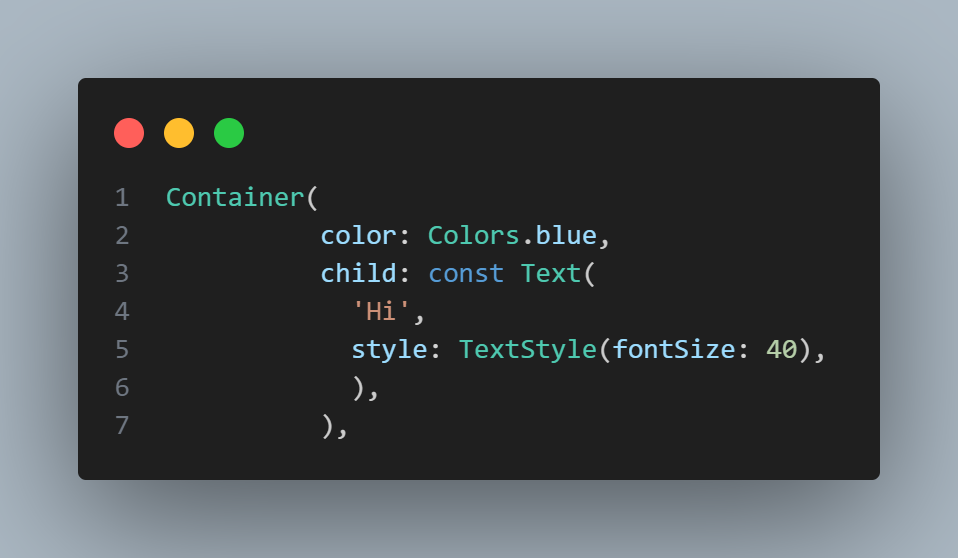
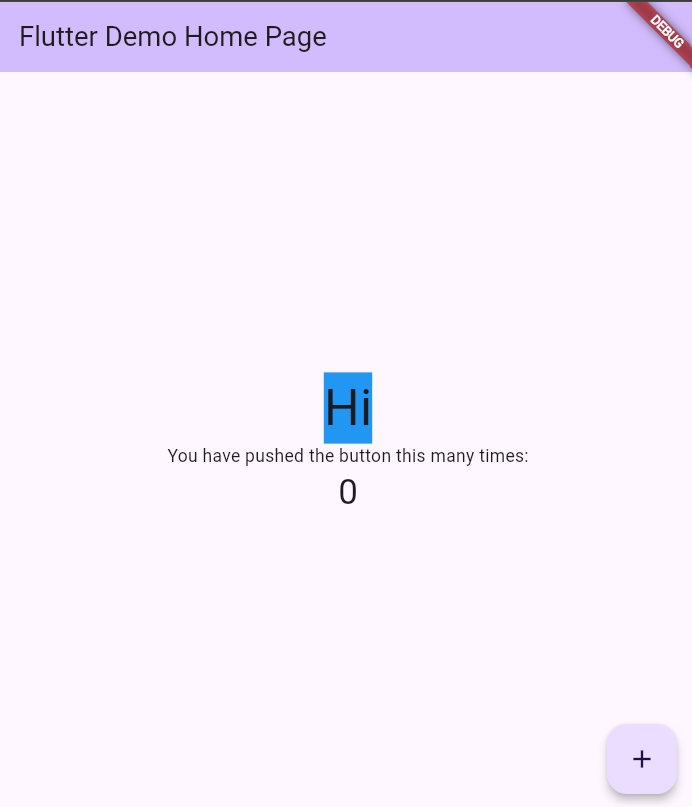
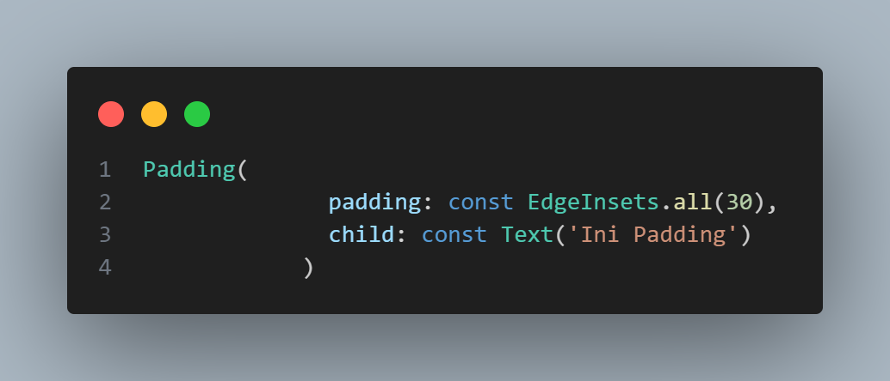
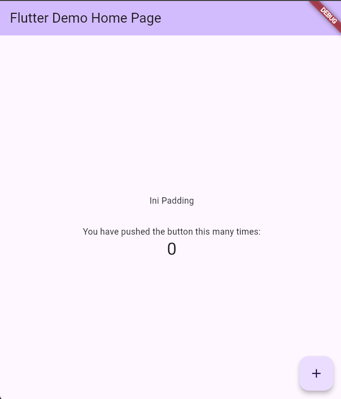
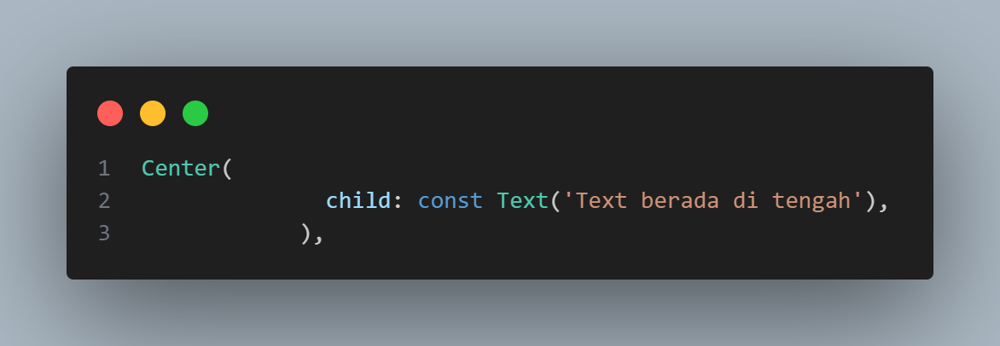
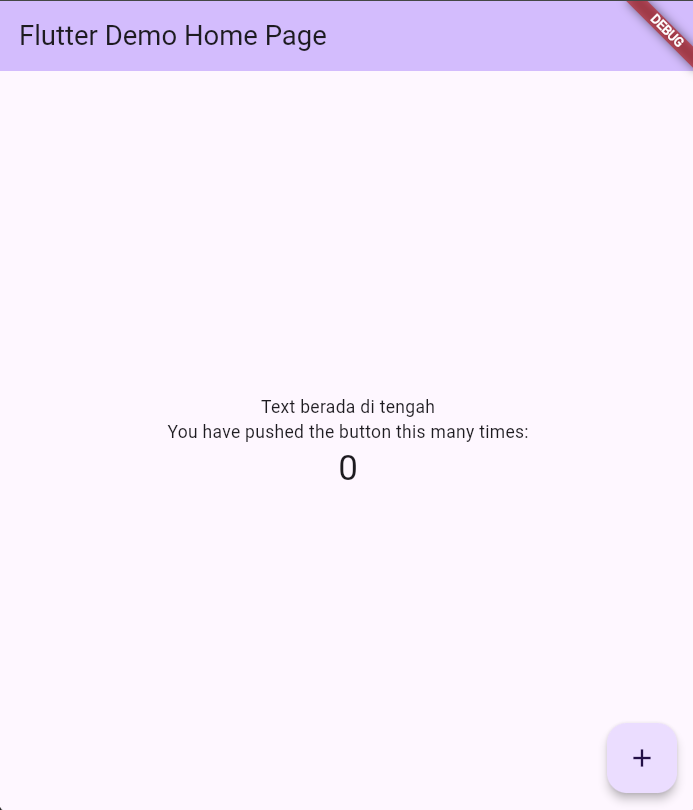
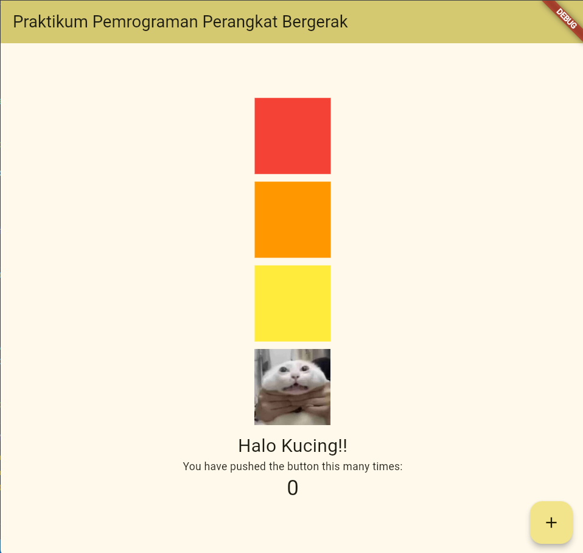

# PENGENALAN FLUTTER DAN WIDGET DASAR

## Apa itu Flutter?

Flutter ditulis menggunakan bahasa C, C++ dan Dart dengan Google’s Skia Graphics Engine untuk user interface. Engine yang digunakan untuk produk ini dikenal seperti Google Chrome, Chrome OS, Chromium OS, Mozilla Firefox, Mozilla Thunderbird, Android, Firefox OS dan sekarang Flutter. Flutter berjalan menggunakan Dart Virtual Machine (VM) di sistem operasi Windows, Linux, dan macOS. Dart VM menggunakan kompilasi kode just-in-time (JIT) yang menyediakan fitur hot-reload untuk menghemat waktu pengembangan.

## Apa itu Widget?

Widget adalah elemen dasar yang digunakan untuk membangun antarmuka pengguna (UI). Setiap elemen visual dalam aplikasi Flutter, seperti tombol, teks, gambar, atau layout, direpresentasikan sebagai widget.Flutter menggunakan arsitektur berbasis widget, artinya hampir semua yang dilihat di layar adalah widget atau kombinasi dari widget-widget lainnya.

### Stateless Widget & Stateful Widget
#### a. Stateless Widget
Stateless Widget adalah widget yang nilai state-nya tidak dapat berubah (immutable) maka widget tersebut lebih bersifat statis dan memiliki interaksi yang terbatas.

#### b. Stateful Widget
Kebalikan dari Stateless Widget, Stateful Widget ialah widget yang state-nya dapat berubah-ubah nilainya, yang berarti Stateful Widget bersifat dinamis dan memiliki interaksi yang tak terbatas

### Scaffold
Scaffold merupakan sebuah widget yang digunakan untuk membuat tampilan dasar material design pada aplikasi Flutter, yang dapat disebut juga dasar sebuah halaman pada aplikasi Flutter.

### Container
Container adalah widget yang digunakan untuk melakukan styling, membuat sebuah shape (bentuk), dan layout pada widget child-nya. Sebagai contoh:

### Padding
Padding merupakan sebuah widget yang khusus untuk memberikan padding pada suatu widget.

### Center
Widget Center merupakan sebuah widget yang digunakan untuk membuat suatu widget berada pada posisi tengah. Penggunaan widget Center sangatlah simpel, yakni seperti berikut:

### Row & Column
#### Widget Row
Untuk membuat widget-widget berjajar secara horizontal kita harus memasukkan widget-widget tersebut ke dalam parameter children. Parameter children berisi kumpulan atau list dari widget karena kita dapat menyusun beberapa widget sekaligus di dalamnya.
#### Widget Column
Kebalikan dari Row, Column merupakan suatu widget yang digunakan untuk membuat widget-widget tersusun berjajar secara vertikal. Column memiliki sintaks mirip dengan Row.

___

## Praktikum

