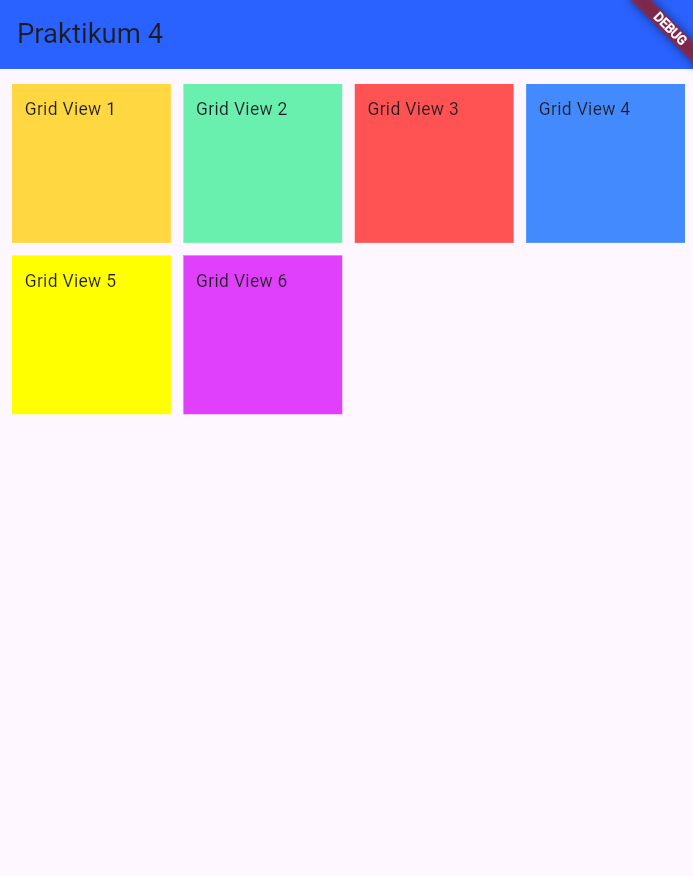
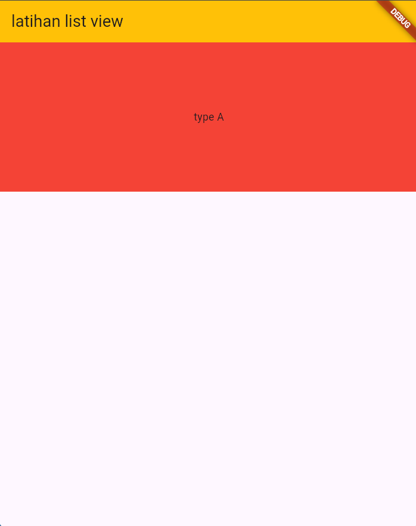
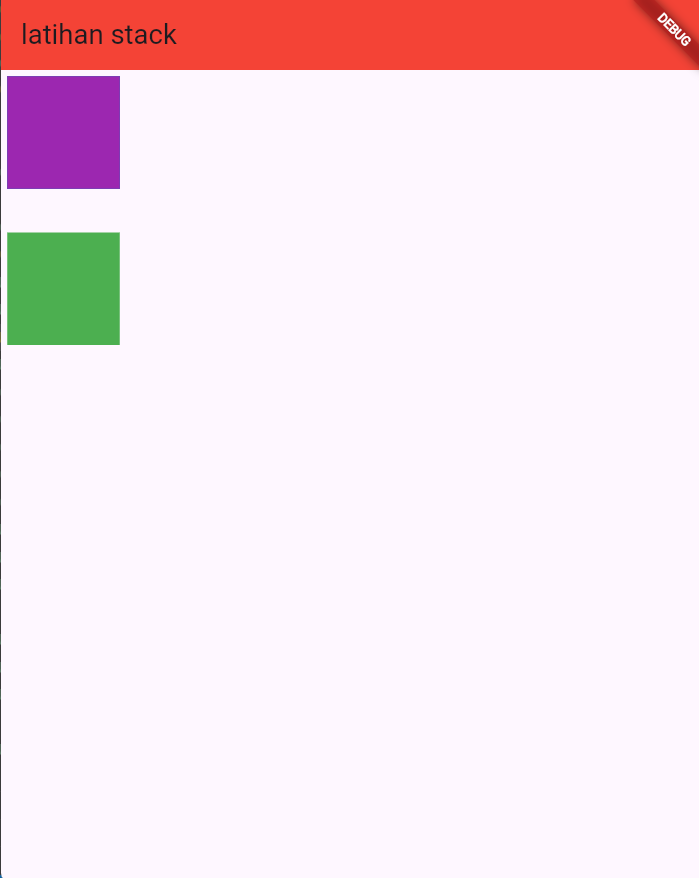
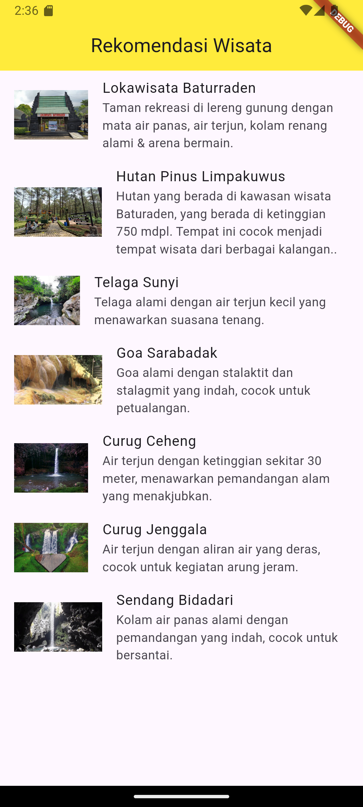
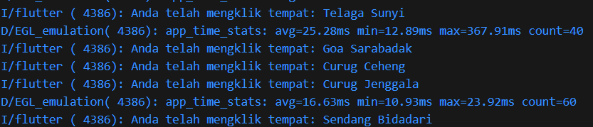

Praktikum Pertemuan ke 4 <br>
Adhitya Sofwan Al-Rasyid <br>
2211104089
# **ANTARMUKA PENGGUNA**

# GUIDED

## Apa itu Widget

Pada dasarnya semua tampilan di dalam Flutter adalah komponen yang bernama Widget, dan akan dipecah menjadi komponen-komponen yang kecil serta memiliki environment sendiri untuk mengelola dirinya.

### Container

widget dasar yang digunakan untuk menentukan batasan atau constraints dari child widget-nya.

### Row dan Column

untuk mengatur child widget secara horizontal atau vertical.

### Stack

digunakan untuk menumpuk beberapa widget di atau satu sama lain.

### Expanded dan Flexible

mengatur bagaimana child widget mengisi ruang yang tersedia.

### ListView

digunakan untuk menampilkan daftar item yang dapat di-scroll.

### GridView

digunakan untuk menampilkan daftar item dalam bentuk grid.

### Wrap

digunakan untuk menampilkan child widget dalam baris atau kolom. jika child widget melebihi lebar atau tinggi dari warp, maka widget tersebut akan dibungkus ke baris atau kolom berikutnya.

### Table

digunakan untuk menampilkan data dalam bentuk tabel. TableRow untuk menambah baris, TabelCell untuk menambah kolom.

## GridView

GridView merupakan widget yang serupa dengan Array 2D dalam bahasa pemrograman apapun. Widget tersebut digunakan ketika harus menampilkan sesuatu pada Grid tersebut, seperti menampilkan images, text, icons, dll.

```
class _MyWidgetState extends State<MyWidget> {
  @override
  Widget build(BuildContext context) {
    return Scaffold(
      appBar: AppBar(
        title: Text('Praktikum 4'),
        backgroundColor: Colors.blueAccent[700],
      ),
      body: GridView.count(
        crossAxisCount: 4,
        mainAxisSpacing: 10,
        crossAxisSpacing: 10,
        padding: EdgeInsets.all(12),
        children: [
          Container(
            padding: EdgeInsets.all(10),
            child: Text('gridView 1'),
            color: Colors.amberAccent,
          ),
          Container(
            padding: EdgeInsets.all(10),
            child: Text('gridView 2'),
            color: Colors.greenAccent,
          ),
          Container(
            padding: EdgeInsets.all(10),
            child: Text('gridView 3'),
            color: Colors.redAccent,
          ),
          Container(
            padding: EdgeInsets.all(10),
            child: Text('gridView 4'),
            color: Colors.blueAccent,
          ),
          Container(
            padding: EdgeInsets.all(10),
            child: Text('gridView 5'),
            color: Colors.yellowAccent,
          ),
          Container(
            padding: EdgeInsets.all(10),
            child: Text('gridView 6'),
            color: Colors.purpleAccent,
          ),
        ],
      ),
    );
  }
}
```



## ListView

ListView merupakan widget scroll yang paling umum digunakan. Widget ini dapat menampilkan lebih dari satu komponen atau widget melalui variabel children. Pada pembahasan kali ini akan menggunakan ListView default dengan variabel children pada widget tersebut>. Cara penggunaan ListView ini dengan memasukkan widget yang ingin disusun sebagai children dari ListView.

```
import 'package:flutter/material.dart';

class listviewscreen extends StatelessWidget {
  const listviewscreen({super.key});

  @override
  Widget build(BuildContext context) {
    return Scaffold(
      appBar: AppBar(
        title: Text('latihan list view'),
        backgroundColor: Colors.amber,
      ),
      body: ListView(
        // ScrollDirection: Axis.horizontal,
        children: [
          Container(
            height: 200,
            width: 200,
            color: Colors.red,
            child: Center(child: Text("type A")),
          ),
        ],
      ),
    );
  }
}
```


## Stack

merupakan widget yang saling tumpang tindih terhadap widget lain. Seperti image dan text yang saling bertumpuk, atau overlay yang terdapat button dan widget lainnya. Dengan menggunakan Stack dapat memposisikan widget satu sama lain dan bertumpukan antar widget.

```
import 'package:flutter/material.dart';

class stackscreen extends StatelessWidget {
  const stackscreen({super.key});

  @override
  Widget build(BuildContext context) {
    return  Scaffold(
      appBar: AppBar(
        title: Text("latihan stack"),
        backgroundColor: Colors.red,
      ),
      body: Column(
        children: [
          Stack(
            alignment: Alignment.topRight,
            children :[
              Container(
                margin: EdgeInsets.all(5),
                width: 90,
                height: 90,
                color: Colors.green,
              ),
              Container(
                margin: EdgeInsets.all(5),
                width: 90,
                height: 90,
                color: Colors.black,
              ),
              Container(
                margin: EdgeInsets.all(5),
                width: 90,
                height: 90,
                color: Colors.blue,
              ),
              Container(
                margin: EdgeInsets.all(5),
                width: 90,
                height: 90,
                color: Colors.purple,
              ),
            ],
          ),
          SizedBox(
            height: 30,
          ),
          Container(
            width: 90,
            height: 90,
            color: Colors.green,
          )
        ],
      ),
    );
  }
}
```


# =======================

# UNGUIDED
1. Modifikasi project TP 04 (Tugas Pendahuluan) untuk Antarmuka Pengguna, yang mana di dalamnya terdapat ListView, untuk merekomendasikan beberapa tempat wisata yang ada di Banyumas disertai foto, nama wisata, dan deskripsi singkat! (buatlah se kreatif mungkin).


## Source Code
```
import 'package:flutter/material.dart';

void main() {
  runApp(const MyApp());
}

class MyApp extends StatelessWidget {
  const MyApp({super.key});

  @override
  Widget build(BuildContext context) {
    return MaterialApp(
      title: 'Wisata App',
      theme: ThemeData(
        colorScheme: ColorScheme.fromSeed(seedColor: Colors.deepPurple),
        useMaterial3: true,
      ),
      home: const MyHomePage(),
    );
  }
}

class MyHomePage extends StatefulWidget {
  const MyHomePage({super.key});

  @override
  State<MyHomePage> createState() => _MyHomePageState();
}

class _MyHomePageState extends State<MyHomePage> {
  final List<Map<String, String>> tempatWisataList = [
    {'name': 'Lokawisata Baturraden', 'description': 'Taman rekreasi di lereng gunung dengan mata air panas, air terjun, kolam renang alami & arena bermain.', 'imageUrl': "https://asset.kompas.com/crops/goNe8LjgsUdKo6OyTlRViyc2Ft0=/0x0:0x0/750x500/data/photo/2021/08/27/612878ce84e64.jpg"},
    {'name': 'Hutan Pinus Limpakuwus', 'description': 'Hutan yang berada di kawasan wisata Baturaden, yang berada di ketinggian 750 mdpl. Tempat ini cocok menjadi tempat wisata dari berbagai kalangan..', 'imageUrl': "https://awsimages.detik.net.id/community/media/visual/2023/11/01/wisata-hutan-pinus-limpakuwus_169.jpeg?w=600&q=90"},
    {'name': 'Telaga Sunyi', 'description': 'Telaga alami dengan air terjun kecil yang menawarkan suasana tenang.', 'imageUrl': "https://visitjawatengah.jatengprov.go.id/assets/images/730c64c2-1e01-41d2-8e4a-36e813e98252.jpg"},
    {'name': 'Goa Sarabadak', 'description': 'Goa alami dengan stalaktit dan stalagmit yang indah, cocok untuk petualangan.', 'imageUrl': "https://asset-2.tstatic.net/banyumas/foto/bank/images/goa-sarabadak.jpg"},
    {'name': 'Curug Ceheng', 'description': 'Air terjun dengan ketinggian sekitar 30 meter, menawarkan pemandangan alam yang menakjubkan.', 'imageUrl': "https://cdn.idntimes.com/content-images/community/2022/01/20220124-230259-329ae2b286ff7799fbbec7d4597d307a-869a438d84b25238ee93e1499cf048f0_600x400.jpg"},
    {'name': 'Curug Jenggala', 'description': 'Air terjun dengan aliran air yang deras, cocok untuk kegiatan arung jeram.', 'imageUrl': "https://asset.kompas.com/crops/vz0cyYnm5q3faqfFPfpdFbLpAUI=/0x83:1000x750/750x500/data/photo/2022/06/02/62980a78e6a0d.jpg"},
    {'name': 'Sendang Bidadari', 'description': 'Kolam air panas alami dengan pemandangan yang indah, cocok untuk bersantai.', 'imageUrl': "https://thumb.tvonenews.com/thumbnail/2022/01/14/61e123e4bf0aa-sendang-bidadari-spot-cantik-tersembunyi-di-baturaden_tvonenews_1265_711.jpg"}
  ];

  @override
  Widget build(BuildContext context) {
    return Scaffold(
      appBar: AppBar(
        title: Center(child: Text("Rekomendasi Wisata")),
        backgroundColor: Colors.yellow,
      ),
      body: ListView.builder(
        itemCount: tempatWisataList.length,
        itemBuilder: (context, index) {
          final place = tempatWisataList[index];
          return ListTile(
            leading: Image.network(place['imageUrl']!),
            title: Text(place['name']!),
            subtitle: Text(place['description']!),
            onTap: () {
              print("Anda telah mengklik tempat: ${place['name']}");
            },
          );
        },
      ),
    );
  }
}

```
## Output



## Deskripsi Program

Aplikasi ini memiliki tampilan utama yang menggunakan tema warna deep purple dan berjudul "Wisata App". Halaman utama menampilkan daftar tempat wisata dengan nama, deskripsi singkat, dan gambar.
Aplikasi dimulai dari fungsi `main` yang menjalankan instance dari kelas `MyApp`. Kelas `MyApp` mengatur tampilan material desain. Kelas `MyHomePage` memuat daftar tempat wisata dalam bentuk list item (`ListTile`). Setiap item mencakup gambar, nama tempat, dan deskripsi. Pengguna dapat menekan item untuk mencetak pesan konfirmasi di console.
Semua tempat wisata memiliki properti nama, deskripsi, dan URL gambar yang valid. Widget `ListView.builder` digunakan untuk menghasilkan daftar dinamis berdasarkan list tempat wisata yang ada.