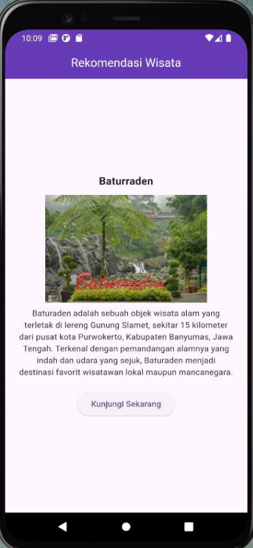
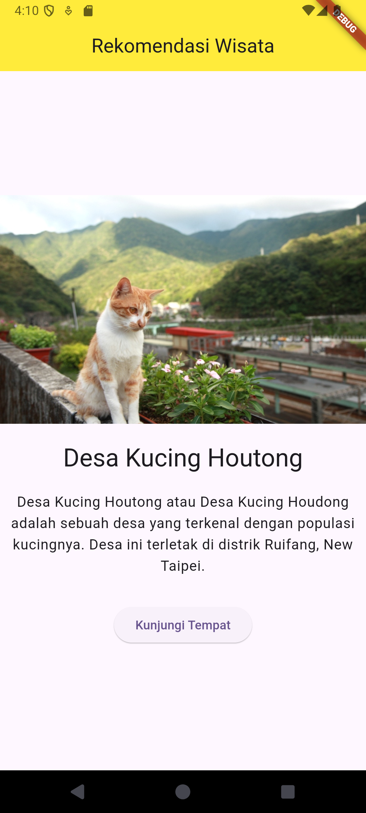
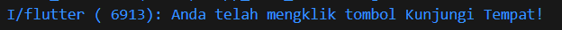

# TUGAS PENDAHULUAN

Buatlah tampilan aplikasi sederhana dalam flutter yang menampilkan deskripsi rekomendasi tempat wisata dengan mengimplementasikan widget dasar
Detail Tugas:

- AppBar: Buatlah sebuah AppBar dengan judul "Rekomendasi Wisata".
- Text: Di tengah layar, tambahkan widget Text dengan pesan "Nama Tempat Wisata".
- Image: Tambahkan gambar dari internet di bawah teks tersebut menggunakan widget Image.network.
- Text: Dibawah gambar, tambahkan deskripsi dari tempat wisata
- Button: Tambahkan tombol di bawah gambar dengan label "Kunjungi Tempat".

Contoh Output :



## Source Code

```
import 'package:flutter/material.dart';

void main() {
  runApp(const MyApp());
}

class MyApp extends StatelessWidget {
  const MyApp({super.key});

  @override
  Widget build(BuildContext context) {
    return MaterialApp(
      title: 'Wisata App',
      theme: ThemeData(
        colorScheme: ColorScheme.fromSeed(seedColor: Colors.deepPurple),
        useMaterial3: true,
      ),
      home: const MyHomePage(),
    );
  }
}

class MyHomePage extends StatefulWidget {
  const MyHomePage({super.key});

  @override
  State<MyHomePage> createState() => _MyHomePageState();
}

class _MyHomePageState extends State<MyHomePage> {
  final String tempatWisata = "Desa Kucing Houtong";
  final String deskripsi =
      "Desa Kucing Houtong atau Desa Kucing Houdong adalah sebuah desa yang terkenal dengan populasi kucingnya. Desa ini terletak di distrik Ruifang, New Taipei.";
  final String imageUrl =
      "https://image.taiwantoday.tw/images/content/img120160803085154827.JPG";

  @override
  Widget build(BuildContext context) {
    return Scaffold(
      appBar: AppBar(
        title: Center(child: Text("Rekomendasi Wisata")),
        backgroundColor: Colors.yellow,
      ),
      body: Center(
        child: Column(
          mainAxisAlignment: MainAxisAlignment.center,
          children: <Widget>[
            Image.network(imageUrl),
            const SizedBox(height: 20),
            Text(
              tempatWisata,
              style: Theme.of(context).textTheme.headlineMedium,
            ),
            const SizedBox(height: 20),
            Text(deskripsi, textAlign: TextAlign.center, style: Theme.of(context).textTheme.bodyLarge),
            const SizedBox(height: 30),
            ElevatedButton(
              onPressed: () {
                print("Anda telah mengklik tombol Kunjungi Tempat!");
              },
              child: Text('Kunjungi Tempat'),
            ),
          ],
        ),
      ),
    );
  }
}
```

## Screenshot Output



## Deskripsi Program

Program ini adalah aplikasi sederhana yang dirancang untuk memberikan rekomendasi wisata. Aplikasi ini menampilkan informasi tentang Desa Kucing Houtong, termasuk deskripsi singkat dan gambar. Tampilan utama terdiri dari AppBar berwarna kuning dengan judul "Rekomendasi Wisata", di mana detail tempat wisata ditampilkan dalam tiga bagian: sebuah gambar dari desa tersebut, nama tempat (Desa Kucing Houtong), dan deskripsi singkat tentang lokasi. Terdapat juga tombol ElevatedButton yang memungkinkan pengguna untuk mencetak pesan ke console jika mereka mengkliknya.



Kelas MyHomePage adalah stateful widget yang mengelola UI aplikasi. Dalam method build, tampilan utama dibuat menggunakan Scaffold, dengan AppBar di bagian atas dan Column sebagai konten utama. Column ini berisi gambar dari desa tersebut, teks nama tempat wisata dalam ukuran font besar, deskripsi singkat tentang lokasi yang ditampilkan secara sentuh, dan tombol yang mencetak pesan ke console jika diklik. Tampilan ini dirancang untuk memberikan pengalaman pengguna yang sederhana dan informatif tentang Desa Kucing Houtong.