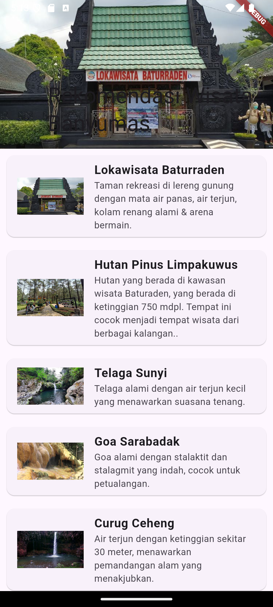
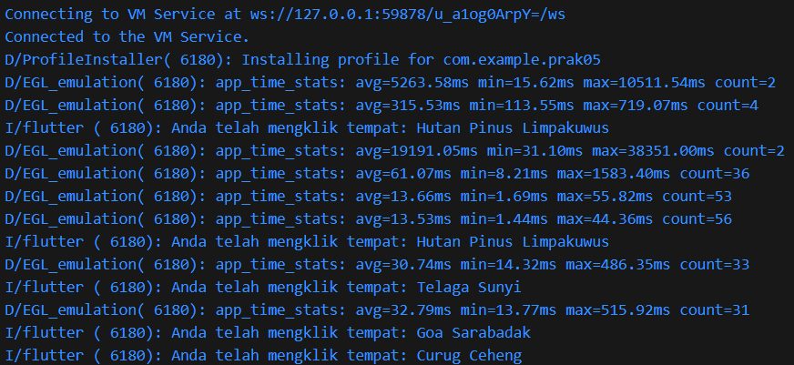

Praktikum Pertemuan ke 5 <br>
Adhitya Sofwan Al-Rasyid <br>
2211104089
# **ANTARMUKA PENGGUNA LANJUTAN**

# GUIDED

## ListView.Builder

Widget ListView jenis ini cocok digunakan ketika memiliki data list yang lebih besar. ListView.builder membutuhkan itemBuilder dan itemCount. Parameter itemBuilder merupakan fungsi yang mengembalikan widget untuk ditampilkan. Sedangkan itemCount kita isi dengan jumlah seluruh item yang ingin ditampilkan.

```
import 'package:flutter/material.dart';

class Listview extends StatelessWidget {
  const Listview({super.key});

  @override
  Widget build(BuildContext context) {
    final List<String> entries = <String>['A', 'B', 'C'];
    final List<int> colorCodes = <int>[600, 500, 100];

    return Scaffold(
      appBar: AppBar(
        title: const Text('Listview builder'),
        backgroundColor: Colors.amber,
      ),
      body: ListView.builder(
        padding: const EdgeInsets.all(8),
        itemCount: entries.length,
        itemBuilder: (BuildContext context, int index) {
          return Container(
            height: 50,
            color: Colors.amber[colorCodes[index]],
            child: Center(
              child: Text('Entry ${entries[index]}'),
            ),
          );
        },
      ),
    );
  }
}
```


## ListView.Separated

ListView jenis ini akan menampilkan daftar item yang dipisahkan dengan separator. Penggunaan ListView.separated mirip dengan builder, yang membedakan adalah terdapat satu parameter tambahan wajib yaitu separatorBuilder yang mengembalikan Widget yang akan berperan sebagai separator

```
import 'package:flutter/material.dart';

class Listviewseparated extends StatelessWidget {
  const Listviewseparated({super.key});

  @override
  Widget build(BuildContext context) {
    final List<String> entries = <String>['A', 'B', 'C', 'D'];
    final List<int> colorCodes = <int>[100, 200, 300, 400];
    return Scaffold(
        appBar: AppBar(
          title: const Text('Jenis Listview'),
          backgroundColor: Colors.amberAccent,
        ),
        body: ListView.separated(
            itemBuilder: (BuildContext, int index) {
              return Container(
                  height: 50,
                  color: Colors.amber[colorCodes[index]],
                  child: Center(
                    child: Text('Entry ${entries[index]}'),
                  ));
            },
            itemCount: entries.length,
            separatorBuilder: (BuildContext context, int index) {
              return Container(
                height: 10,
                color: Colors.red,
              );
            }));
  }
}
```


## Flexible dan Expanded

### Flexible

Flexible digunakan ketika Anda ingin memberikan ruang fleksibel kepada widget di dalam kolom atau baris. Dengan Flexible, widget dapat mengambil ruang yang tersisa di dalam layout, tetapi tetap memiliki batas maksimal yang disesuaikan dengan kebutuhan ruangnya.

### Expanded

Expanded adalah turunan dari Flexible yang secara otomatis mengisi semua ruang yang tersisa di dalam kolom atau baris. Ketika Anda menggunakan Expanded, widget tersebut akan mengambil ruang sebanyak mungkin tanpa memperhatikan kebutuhan ruang minimum.

```
import 'package:flutter/material.dart';

class FlexibleExpandedScreen extends StatelessWidget {
  const FlexibleExpandedScreen({super.key});

  @override
  Widget build(BuildContext context) {
    return Scaffold(
      appBar: AppBar(
        title: const Text('Flexible vs Expanded'),
        backgroundColor: Colors.amber,
      ),
      body: Column(
        children: [
          SizedBox(
            height: 10,
          ),
          const Text(
            "Flexible",
            style: TextStyle(fontSize: 20),
          ),
          const SizedBox(
            height: 8,
          ),
          // Flexible
          Row(
            children: <Widget>[
              Container(
                width: 50,
                height: 100,
                color: Colors.red,
              ),
              Flexible(
                child: Container(
                  height: 100,
                  color: Colors.green,
                  child: const Padding(
                    padding: EdgeInsets.all(8.0),
                    child: Text(
                      "This Flexible takes up the remaining space but can shrink if needed.",
                    ),
                  ),
                ),
              ),
              const Icon(Icons.sentiment_very_satisfied),
            ],
          ),

          SizedBox(
            height: 10,
          ),
          const Text(
            "Expanded",
            style: TextStyle(fontSize: 20),
          ),
          const SizedBox(
            height: 8,
          ),
          const SizedBox(height: 20),
          // Expanded
          Row(
            children: <Widget>[
              Container(
                width: 50,
                height: 100,
                color: Colors.red,
              ),
              Expanded(
                child: Container(
                  height: 100,
                  color: Colors.green,
                  child: const Padding(
                    padding: EdgeInsets.all(8.0),
                    child: Text(
                      "This Expanded forces the widget to take up all the remaining space.",
                    ),
                  ),
                ),
              ),
              const Icon(Icons.sentiment_very_satisfied),
            ],
          ),
        ],
      ),
    );
  }
}
```


## CustomScrollView

Widget ini memungkinkan membuat efek pada list, grid, maupun header yang lebar. Misalnya, ketika ingin membuat scroll view yang berisi app bar yang lebar yang meliputi list dan grid secara bersamaan, maka bisa menggunakan 3 widget sliver, yaitu SliverAppBar, SliverList, dan SliverGrid

```
import 'package:flutter/material.dart';

class Custom extends StatelessWidget {
  const Custom({super.key});

  @override
  Widget build(BuildContext context) {
    return Scaffold(
      appBar: AppBar(
        title: const Text('Custom'),
        centerTitle: true,
        backgroundColor: Colors.amber,
      ),
      body: CustomScrollView(
        slivers: <Widget>[
          //Sliver App Bar
          const SliverAppBar(
            pinned: true,
            expandedHeight: 250.0,
            flexibleSpace: FlexibleSpaceBar(
              title: Text('Demo'),
              centerTitle: true,
            ),
          ),
          //Sliver Grid
          SliverGrid(
            gridDelegate: const SliverGridDelegateWithMaxCrossAxisExtent(
              maxCrossAxisExtent: 200.0,
              mainAxisSpacing: 10.0,
              crossAxisSpacing: 10.0,
              childAspectRatio: 4.0,
            ),
            delegate: SliverChildBuilderDelegate(
              (BuildContext context, int index) {
                return Container(
                  alignment: Alignment.center,
                  color: Colors.teal[100 * (index % 9)],
                  child: Text('Grid Item $index'),
                );
              },
              childCount: 20,
            ),
          ),
          //Sliver Fixed List
          SliverFixedExtentList(
            itemExtent: 50.0,
            delegate: SliverChildBuilderDelegate(
              (BuildContext context, int index) {
                return Container(
                  alignment: Alignment.center,
                  color: Colors.lightBlue[100 * (index % 9)],
                  child: Text('List Item $index'),
                );
              },
              childCount: 50,
            ),
          ),
        ],
      ),
    );
  }
}
```


# =======================

# UNGUIDED

1. Modifikasi project Rekomendasi Wisata pada Tugas Unguided 04 modul Antarmuka Pengguna dengan mengimplementasikan widget CustomScrollView, SliverAppBar, dan SliverList untuk merekomendasikan beberapa tempat wisata yang ada di Banyumas disertai foto, nama wisata, dan deskripsi singkat! (buatlah se kreatif mungkin).

## Source Code

```
import 'package:flutter/material.dart';

void main() {
  runApp(const MyApp());
}

class MyApp extends StatelessWidget {
  const MyApp({super.key});

  @override
  Widget build(BuildContext context) {
    return MaterialApp(
      title: 'Wisata App',
      theme: ThemeData(
        colorScheme: ColorScheme.fromSeed(seedColor: Colors.deepPurple),
        useMaterial3: true,
      ),
      home: const MyHomePage(),
    );
  }
}

class MyHomePage extends StatefulWidget {
  const MyHomePage({super.key});

  @override
  State<MyHomePage> createState() => _MyHomePageState();
}

class _MyHomePageState extends State<MyHomePage> {
  final List<Map<String, String>> tempatWisataList = [
    {
      'name': 'Lokawisata Baturraden',
      'description':
          'Taman rekreasi di lereng gunung dengan mata air panas, air terjun, kolam renang alami & arena bermain.',
      'imageUrl':
          "https://asset.kompas.com/crops/goNe8LjgsUdKo6OyTlRViyc2Ft0=/0x0:0x0/750x500/data/photo/2021/08/27/612878ce84e64.jpg"
    },
    {
      'name': 'Hutan Pinus Limpakuwus',
      'description':
          'Hutan yang berada di kawasan wisata Baturaden, yang berada di ketinggian 750 mdpl. Tempat ini cocok menjadi tempat wisata dari berbagai kalangan..',
      'imageUrl':
          "https://awsimages.detik.net.id/community/media/visual/2023/11/01/wisata-hutan-pinus-limpakuwus_169.jpeg?w=600&q=90"
    },
    {
      'name': 'Telaga Sunyi',
      'description':
          'Telaga alami dengan air terjun kecil yang menawarkan suasana tenang.',
      'imageUrl':
          "https://visitjawatengah.jatengprov.go.id/assets/images/730c64c2-1e01-41d2-8e4a-36e813e98252.jpg"
    },
    {
      'name': 'Goa Sarabadak',
      'description':
          'Goa alami dengan stalaktit dan stalagmit yang indah, cocok untuk petualangan.',
      'imageUrl':
          "https://asset-2.tstatic.net/banyumas/foto/bank/images/goa-sarabadak.jpg"
    },
    {
      'name': 'Curug Ceheng',
      'description':
          'Air terjun dengan ketinggian sekitar 30 meter, menawarkan pemandangan alam yang menakjubkan.',
      'imageUrl':
          "https://cdn.idntimes.com/content-images/community/2022/01/20220124-230259-329ae2b286ff7799fbbec7d4597d307a-869a438d84b25238ee93e1499cf048f0_600x400.jpg"
    },
    {
      'name': 'Curug Jenggala',
      'description':
          'Air terjun dengan aliran air yang deras, cocok untuk kegiatan arung jeram.',
      'imageUrl':
          "https://asset.kompas.com/crops/vz0cyYnm5q3faqfFPfpdFbLpAUI=/0x83:1000x750/750x500/data/photo/2022/06/02/62980a78e6a0d.jpg"
    },
    {
      'name': 'Sendang Bidadari',
      'description':
          'Kolam air panas alami dengan pemandangan yang indah, cocok untuk bersantai.',
      'imageUrl':
          "https://thumb.tvonenews.com/thumbnail/2022/01/14/61e123e4bf0aa-sendang-bidadari-spot-cantik-tersembunyi-di-baturaden_tvonenews_1265_711.jpg"
    },
  ];

  @override
  Widget build(BuildContext context) {
    return Scaffold(
      body: CustomScrollView(
        slivers: [
          SliverAppBar(
            expandedHeight: 200.0,
            flexibleSpace: FlexibleSpaceBar(
              title: Text("Rekomendasi Wisata Banyumas"),
              background: Image.network(
                "https://asset.kompas.com/crops/goNe8LjgsUdKo6OyTlRViyc2Ft0=/0x0:0x0/750x500/data/photo/2021/08/27/612878ce84e64.jpg",
                fit: BoxFit.cover,
              ),
            ),
            floating: true,
            pinned: true,
            backgroundColor: Colors.deepPurple,
          ),
          SliverList(
            delegate: SliverChildBuilderDelegate(
              (context, index) {
                final place = tempatWisataList[index];
                return Card(
                  margin: EdgeInsets.all(10.0),
                  child: ListTile(
                    leading: Image.network(
                      place['imageUrl']!,
                      fit: BoxFit.cover,
                      width: 100,
                      height: 100,
                    ),
                    title: Text(
                      place['name']!,
                      style: TextStyle(
                        fontWeight: FontWeight.bold,
                        fontSize: 18,
                      ),
                    ),
                    subtitle: Text(place['description']!),
                    onTap: () {
                      print("Anda telah mengklik tempat: ${place['name']}");
                    },
                  ),
                );
              },
              childCount: tempatWisataList.length,
            ),
          ),
        ],
      ),
    );
  }
}
```

## Output




## Deskripsi Program

Aplikasi ini adalah modifikasi dari aplikasi pada tugas unguided praktikum 04, modifikasi tersebut menyakup implementasi widget CustomScrollView, SliverAppBar, dan SliverList.