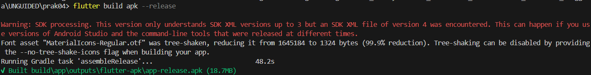
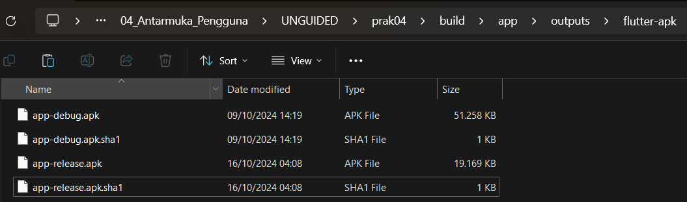

# TUGAS PENDAHULUAN

Pada tugas pendahuluan ini, dari aplikasi Rekomendasi Wisata yang telah kalian buat pada Unguided Modul 4 (Antarmuka Pengguna), ubahlah menjadi file APK dengan cara build APK. Kemudian, upload file APK tersebut ke dalam folder 5_Antarmuka_Pengguna_Lanjutan pada Submodul TP.

## Source Code

## Screenshot Output

## Deskripsi Program
Command "flutter build apk --release" digunakan untuk membuild file APK dari aplikasi flutter dalam mode release. Fungsi utamanya adalah menghasilkan file APK yang siap untuk diinstal ke perangkat android. Cara memasukkan command tersebut yaitu dengan membuka terminal dan mengarahkannya ke folder project terlebih dahulu lalu menjalankan command tersebut. Hasil file dapat ditemukan di direktori build/app/outputs/flutter-apk/