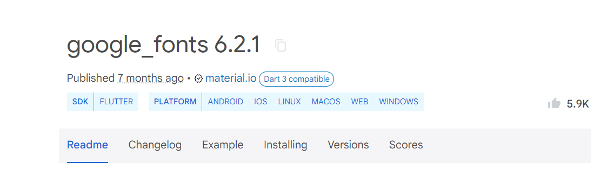
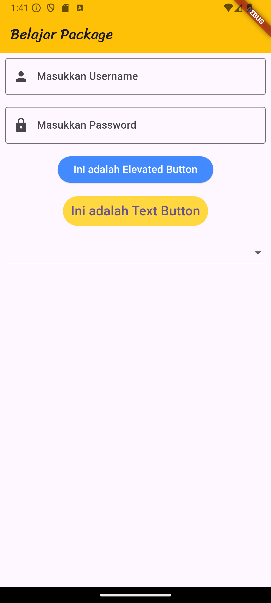
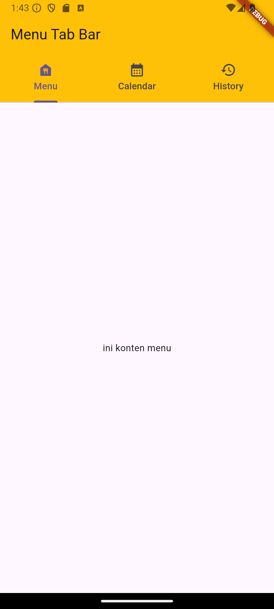
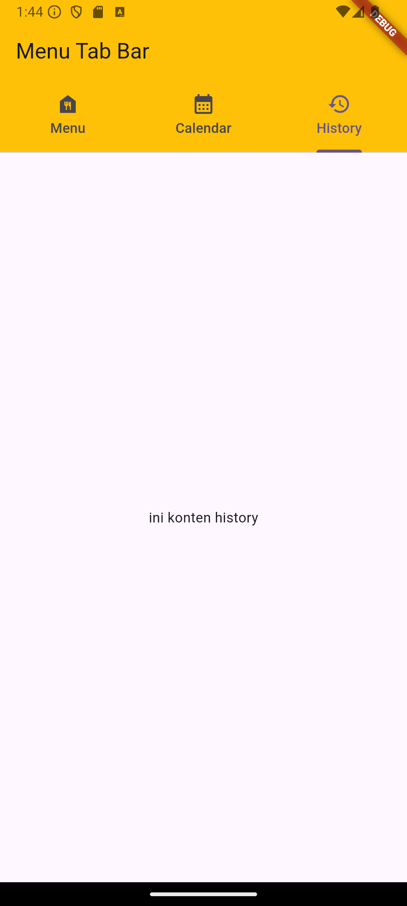
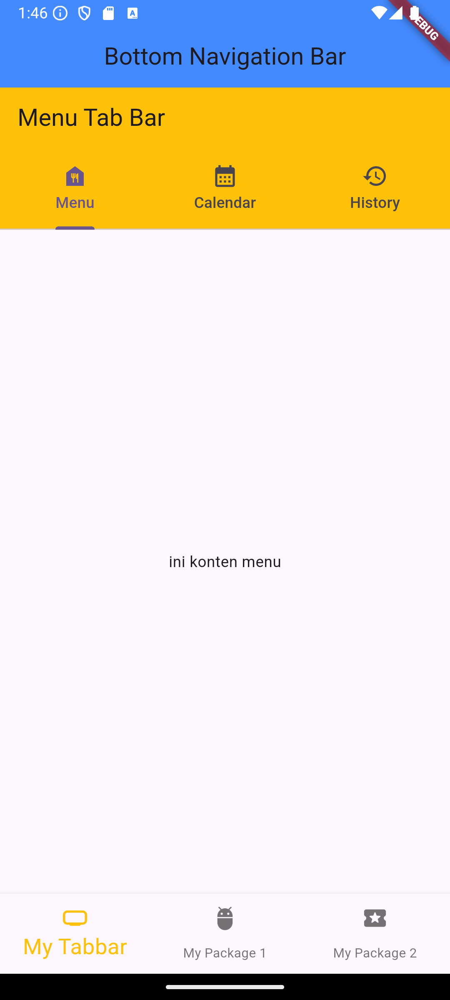
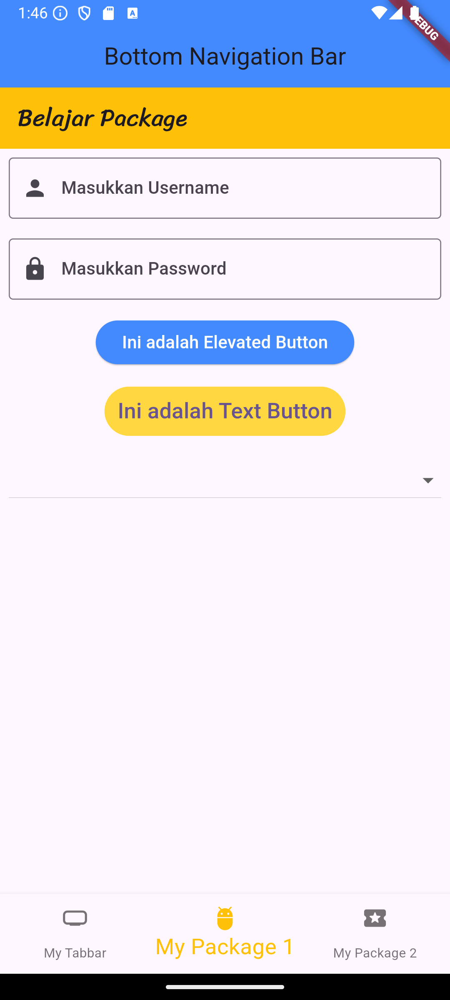
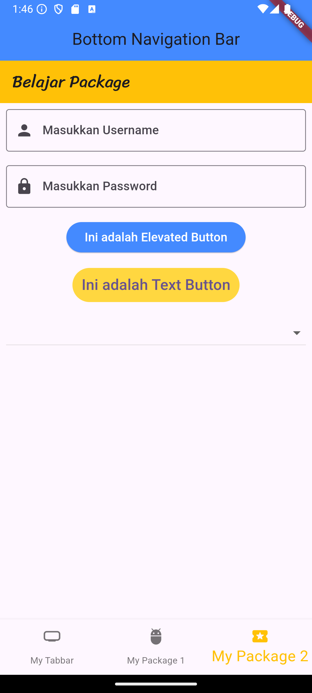
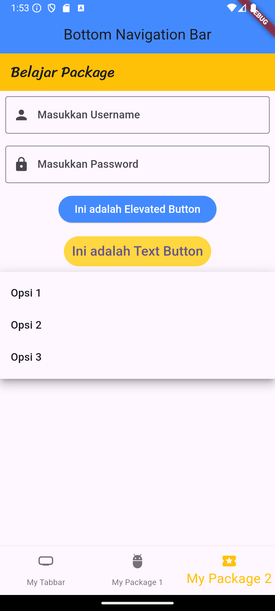

Praktikum Pertemuan ke 6 <br>
Adhitya Sofwan Al-Rasyid <br>
2211104089
# **INTERAKSI PENGGUNA**

# GUIDED

## Packages

Secara singkat, dart package terdapat pada direktori yang didalamnya terdapat file pubspec.yaml. Contoh penggunaan packages adalah membuat request ke server menggunakan protokol http. Custom navigation/route handling menggunakan fluro, dsb.



```
dependencies:
  flutter:
    sdk: flutter


  # The following adds the Cupertino Icons font to your application.
  # Use with the CupertinoIcons class for iOS style icons.
  cupertino_icons: ^1.0.8
  google_fonts: ^6.2.1
```

Untuk menggunakannya, import package tersebut pada file dart

```
import 'package:google_fonts/google_fonts.dart';
```

## User Interaction

### Stateful & Stateless

Widget stateless tidak pernah berubah. Ikon, IconButton, dan Teks adalah contoh widget stateless. Sub kelas widget stateless StatelessWidget. Widget stateful bersifat dinamis misalnya, ia dapat mengubah tampilannya sebagai respons terhadap peristiwa yang dipicu oleh interaksi pengguna atau saat menerima data. Kotak centang, Radio, Slider, InkWell, Form, dan TextField adalah contoh widget stateful. Subkelas widget stateful StatefulWidget.

### Form
Form adalah kumpulan widget yang digunakan untuk mengumpulkan input dari pengguna. Biasanya, form ini terdiri dari beberapa field seperti TextFormField, Checkbox, Radio, dan lain-lain. Anda dapat menggunakan Form widget untuk mengelompokkan dan mengelola status dari semua field dalam form

```
import 'package:flutter/material.dart';
import 'package:google_fonts/google_fonts.dart';

class MyPackage extends StatefulWidget {
  const MyPackage({super.key});

  @override
  State<MyPackage> createState() => _MyPackageState();
}

class _MyPackageState extends State<MyPackage> {
  String? selectedValue;


  @override
  Widget build(BuildContext context) {
    return Scaffold(
      appBar: AppBar(
        title: Text(
          "Belajar Package",
          style: GoogleFonts.sriracha(),
        ),
        backgroundColor: Colors.amber,
      ),
      body: Padding(
        padding: const EdgeInsets.all(8.0),
        child: Column(
          children: [
            TextField(
              obscureText: false,
              obscuringCharacter: "*",
              decoration: InputDecoration(
                  // icon: Icon(Icons.person),
                  prefixIcon: Icon(Icons.person),
                  hintText: "Masukkan Username",
                  border: OutlineInputBorder()),
            ),
            SizedBox(
              height: 18,
            ),
            TextField(
              obscureText: true,
              obscuringCharacter: "*",
              decoration: InputDecoration(
                  // icon: Icon(Icons.person),
                  prefixIcon: Icon(Icons.lock),
                  hintText: "Masukkan Password",
                  border: OutlineInputBorder()),
            ),
            SizedBox(height: 15),
            ElevatedButton(
              onPressed: () {},
              child: Text(
                "Ini adalah Elevated Button",
                style: TextStyle(
                  color: Colors.white,
                  fontSize: 16,
                ),
              ),
              style: ElevatedButton.styleFrom(
                backgroundColor: Colors.blueAccent,
              ),
            ),
            SizedBox(height: 15),
            TextButton(
              style: TextButton.styleFrom(
                backgroundColor: Colors.amberAccent
              ),
            onPressed: () {},
            child: Text(
              "Ini adalah Text Button", style: TextStyle(fontSize: 20),
              ),
            ),
            SizedBox(height: 15),
            DropdownButton<String>(
              // focusColor: Colors.green,
              isExpanded: true,
              value: selectedValue,
              items: <String>['Opsi 1','Opsi 2','Opsi 3']
                .map<DropdownMenuItem<String>>((String value) {
              return DropdownMenuItem<String>(
                value: value,
                child: Text(value),
              );
              }).toList(), 
              onChanged: (String? newValue) {
              setState(() {
                selectedValue = newValue;
              });
            })
          ],
        ),
      ),
    );
  }
}
```



### Menu

Salah satu hal penting dari pembuatan aplikasi adalah menu. Menu ini berfungsi untuk separasi antar fitur atau page. Sulit rasanya apabila semua fitur ditampilkan dalam satu halaman, selain sulit, pengguna akan kesulitan dalam mengoperasikannya. Maka disini menu page sangat bermanfaat. Secara umum terdapat 2 jenis widget menu yang sering digunakan, yaitu `bottom navigation bar` dan `tab bar`. Karena Flutter mendukung penuh guideline yang dibuat oleh Google, yaitu Material Design.

- Tab bar

```
import 'package:flutter/material.dart';

class MyTabbar extends StatefulWidget {
  const MyTabbar({super.key});

  @override
  State<MyTabbar> createState() => _MyTabbarState();
}

class _MyTabbarState extends State<MyTabbar> {
  @override
  Widget build(BuildContext context) {
    return DefaultTabController(
      length: 3,
      child: Scaffold(
        appBar: AppBar(
          title: const Text("Menu Tab Bar"),
          bottom: const TabBar(tabs: [
            Tab(icon: Icon(Icons.food_bank),
            text: "Menu",
            ),
            Tab(icon: Icon(Icons.calendar_month),
            text: "Calendar",
            ),
            Tab(icon: Icon(Icons.history),
            text: "History",
            ),
          ]),
          backgroundColor: Colors.amber,
        ),
        body: const TabBarView(children: [
          Center(
            child: Text("ini konten menu"),
          ),
          Center(
            child: Text("ini konten calendar"),
          ),
          Center(
            child: Text("ini konten history"),
          ),
        ])
      ),
    );
  }
}
```





- Bottom Navigation Bar

```
import 'package:flutter/material.dart';
import 'package:prak06/my_package.dart';
import 'package:prak06/my_tabbar.dart';

class MyNavbar extends StatefulWidget {
  const MyNavbar({super.key});

  @override
  State<MyNavbar> createState() => _MyNavbarState();
}

class _MyNavbarState extends State<MyNavbar> {
  int _selectedindex = 0;

  void _onTappedItem(int index) {
    setState(() {
      _selectedindex = index;
    });
  }

  List<Widget> _pages = <Widget>[
    MyTabbar(),
    MyPackage(),
    MyPackage(),
  ];

  @override
  Widget build(BuildContext context) {
    return Scaffold(
      appBar: AppBar(
        title: Text("Bottom Navigation Bar"),
        centerTitle: true,
        backgroundColor: Colors.blueAccent,
      ),
      body: _pages[_selectedindex],
      bottomNavigationBar: BottomNavigationBar(
        items: <BottomNavigationBarItem>[
          BottomNavigationBarItem(
            icon: Icon(Icons.home_max_rounded),
            label: 'My Tabbar'
          ),
          BottomNavigationBarItem(
            icon: Icon(Icons.adb_rounded),
            label: 'My Package 1'
          ),
          BottomNavigationBarItem(
            icon: Icon(Icons.local_activity_rounded),
            label: 'My Package 2'
          ),
        ],
        selectedItemColor: Colors.amber,
        currentIndex: _selectedindex,
        onTap: _onTappedItem,
        selectedFontSize: 20,
      ),
    );
  }
}
```





### Buttons

- Elevated Button
ElevatedButton adalah tombol yang biasa kita gunakan saat kita mendaftar, submit, login, dst. Widget ini digunakan untuk membuat tombol dengan tampilan yang lebih menonjol, biasanya dengan efek bayangan yang memberikan kesan kedalaman. Tombol ini ideal untuk aksi yang lebih penting atau membutuhkan perhatian lebih dari pengguna.

```
            ElevatedButton(
              onPressed: () {},
              child: Text(
                "Ini adalah Elevated Button",
                style: TextStyle(
                  color: Colors.white,
                  fontSize: 16,
                ),
              ),
              style: ElevatedButton.styleFrom(
                backgroundColor: Colors.blueAccent,
              ),
            ),
```


- Text Button
TextButton adalah widget yang digunakan untuk membuat tombol yang menampilkan teks. Tombol ini memiliki tampilan yang sederhana dan biasanya digunakan untuk tindakan yang tidak terlalu mencolok.

```
            TextButton(
              style: TextButton.styleFrom(
                backgroundColor: Colors.amberAccent
              ),
            onPressed: () {},
            child: Text(
              "Ini adalah Text Button", style: TextStyle(fontSize: 20),
              ),
            ),
```            


- DropdownButton
DropdownButton adalah widget yang memungkinkan pengguna untuk memilih satu nilai dari serangkaian pilihan yang disediakan dalam bentuk menu dropdown. Ini sangat berguna untuk situasi di mana Anda ingin membatasi pilihan pengguna ke beberapa opsi yang sudah ditentukan.

```
            DropdownButton<String>(
              // focusColor: Colors.green,
              isExpanded: true,
              value: selectedValue,
              items: <String>['Opsi 1','Opsi 2','Opsi 3']
                .map<DropdownMenuItem<String>>((String value) {
              return DropdownMenuItem<String>(
                value: value,
                child: Text(value),
              );
              }).toList(), 
              onChanged: (String? newValue) {
              setState(() {
                selectedValue = newValue;
              });
            })
```




# =======================

# UNGUIDED

1. Modifikasi project TP 06 (Tugas Pendahuluan) Interaksi Pengguna, dengan mengimplementasikan penggunaan form dan button.

## Source Code

```
import 'package:flutter/material.dart';

void main() {
  runApp(const MyApp());
}

class MyApp extends StatelessWidget {
  const MyApp({super.key});

  @override
  Widget build(BuildContext context) {
    return MaterialApp(
      title: 'Latihan Bottom Navigation Bar',
      theme: ThemeData(
        colorScheme: ColorScheme.fromSeed(seedColor: Colors.deepPurple),
        useMaterial3: true,
      ),
      home: const MyHomePage(title: 'Latihan Bottom Navigation Bar'),
    );
  }
}

class MyHomePage extends StatefulWidget {
  const MyHomePage({super.key, required this.title});

  final String title;

  @override
  State<MyHomePage> createState() => _MyHomePageState();
}

class _MyHomePageState extends State<MyHomePage> {
  int _currentIndex = 0;

  final List<Widget> _pages = [
    Padding(
      padding: const EdgeInsets.all(16.0), // Menambahkan padding
      child: Column(
        children: [
          const TextField(
            obscureText: false,
            decoration: InputDecoration(
              hintText: "Masukkan Nama",
              border: OutlineInputBorder(),
            ),
          ),
          const SizedBox(height: 18),
          const TextField(
            obscureText: true,
            obscuringCharacter: "*",
            decoration: InputDecoration(
              hintText: "Masukkan Email",
              border: OutlineInputBorder(),
            ),
          ),
          const SizedBox(height: 15),
          ElevatedButton(
            onPressed: () {},
            child: const Text(
              "Submit",
              style: TextStyle(
                color: Colors.white,
                fontSize: 16,
              ),
            ),
            style: ElevatedButton.styleFrom(
              backgroundColor: Colors.yellow,
            ),
          ),
        ],
      ),
    ),
    const Center(child: Text('Ini adalah halaman Wisata')),
    const Center(child: Text('Ini adalah halaman Profil')),
  ];

  void _onItemTapped(int index) {
    setState(() {
      _currentIndex = index;
    });
  }

  @override
  Widget build(BuildContext context) {
    return Scaffold(
      appBar: AppBar(
        backgroundColor: Theme.of(context).colorScheme.inversePrimary,
        title: Text(widget.title),
      ),
      body: IndexedStack(
        index: _currentIndex,
        children: _pages,
      ),
      bottomNavigationBar: BottomNavigationBar(
        currentIndex: _currentIndex,
        onTap: _onItemTapped,
        items: const [
          BottomNavigationBarItem(
            icon: Icon(Icons.home),
            label: 'Home',
          ),
          BottomNavigationBarItem(
            icon: Icon(Icons.place),
            label: 'Wisata',
          ),
          BottomNavigationBarItem(
            icon: Icon(Icons.person),
            label: 'Profil',
          ),
        ],
      ),
    );
  }
}
```

## Output


## Deskripsi Program

Aplikasi ini adalah hasil modifikasi pada project TP 06, modifikasi yang dilakukan yaitu menambahkan fungsi form dan button.