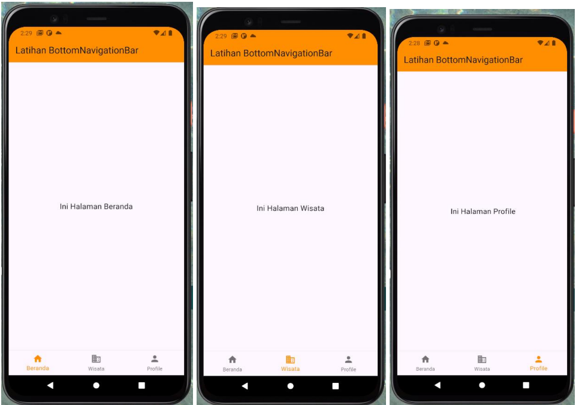
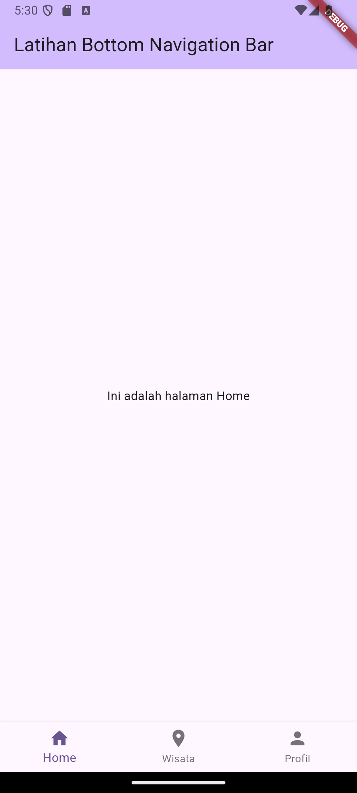
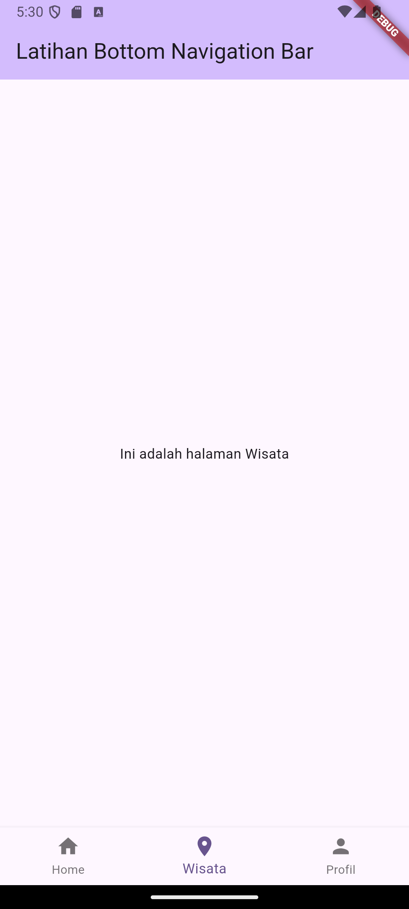
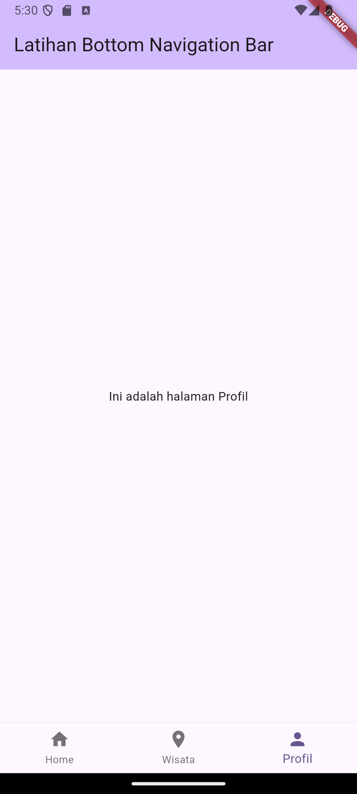

# TUGAS PENDAHULUAN

a. Pada tugas pendahuluan ini, buat project Flutter baru <br>
b. Implementasi Bottom Navigation Bar:

- Tambahkan BottomNavigationBar pada halaman aplikasi.
- BottomNavigationBar memiliki 3 item menu dengan label: "Home", "Wisata", dan "Profil".
- Setiap kali memilih salah satu menu di BottomNavigationBar, halaman yang ditampilkan berubah sesuai menu yang dipilih.
- Home: Menampilkan teks "Ini adalah halaman Home".
- Wisata: Menampilkan teks "Ini adalah halaman Wisata".
- Profile: Menampilkan teks "Ini adalah halaman Profil".

Contoh Output :



## Source Code

```
import 'package:flutter/material.dart';

void main() {
  runApp(const MyApp());
}

class MyApp extends StatelessWidget {
  const MyApp({super.key});

  @override
  Widget build(BuildContext context) {
    return MaterialApp(
      title: 'Latihan Bottom Navigation Bar',
      theme: ThemeData(
        colorScheme: ColorScheme.fromSeed(seedColor: Colors.deepPurple),
        useMaterial3: true,
      ),
      home: const MyHomePage(title: 'Latihan Bottom Navigation Bar'),
    );
  }
}

class MyHomePage extends StatefulWidget {
  const MyHomePage({super.key, required this.title});

  final String title;

  @override
  State<MyHomePage> createState() => _MyHomePageState();
}

class _MyHomePageState extends State<MyHomePage> {
  int _currentIndex = 0;

  final List<Widget> _pages = [
    const Center(child: Text('Ini adalah halaman Home')),
    const Center(child: Text('Ini adalah halaman Wisata')),
    const Center(child: Text('Ini adalah halaman Profil')),
  ];

  void _onItemTapped(int index) {
    setState(() {
      _currentIndex = index;
    });
  }

  @override
  Widget build(BuildContext context) {
    return Scaffold(
      appBar: AppBar(
        backgroundColor: Theme.of(context).colorScheme.inversePrimary,
        title: Text(widget.title),
      ),
      body: IndexedStack(
        index: _currentIndex,
        children: _pages,
      ),
      bottomNavigationBar: BottomNavigationBar(
        currentIndex: _currentIndex,
        onTap: _onItemTapped,
        items: const [
          BottomNavigationBarItem(
            icon: Icon(Icons.home),
            label: 'Home',
          ),
          BottomNavigationBarItem(
            icon: Icon(Icons.place),
            label: 'Wisata',
          ),
          BottomNavigationBarItem(
            icon: Icon(Icons.person),
            label: 'Profil',
          ),
        ],
      ),
    );
  }
}
```

## Screenshot Output





## Deskripsi Program

Aplikasi ini menampilkan tiga halaman berbeda menggunakan `BottomNavigationBar`. Aplikasi ini terdiri dari tiga bagian utama:
1. **Home**: Menampilkan teks "Ini adalah halaman Home".
2. **Wisata**: Menampilkan teks "Ini adalah halaman Wisata".
3. **Profil**: Menampilkan teks "Ini adalah halaman Profil".

Pengguna dapat beralih antar halaman dengan menggunakan `BottomNavigationBar` di bagian bawah layar, yang memiliki tiga item: `Home`, `Wisata`, dan `Profil`. Setiap kali pengguna memilih salah satu item, tampilan di layar berubah sesuai dengan halaman yang terkait. 