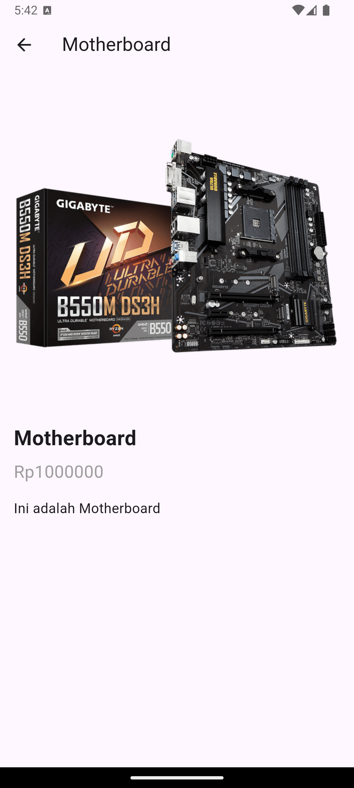

Praktikum Pertemuan ke 7 <br>
Adhitya Sofwan Al-Rasyid <br>
2211104089
# **NAVIGASI NOTIFIKASI**

# GUIDED

## Model

Pada umumnya, hampir seluruh aplikasi yang dibuat akan bekerja dengan data. Data dalam sebuah aplikasi memiliki sangat banyak bentuk, tergantung dari aplikasi yang dibuat. Setiap data yang diterima atau dikirimkan akan lebih baik apabila memiliki standar yang sama. Hampir mustahil melakukan peneliharaan project yang kompleks tanpa model.

### Membuat Model Class

Untuk membuat model, buatlah direktori baru pada folder lib project flutter, kemudian buat sebuah file class dart dengan nama filenya adalah nama data yang ingin dijadikan model.


```
class Product {
  final int id;
  final String nama;
  final double harga;
  final String gambarUrl;
  final String deskripsi;

  // constructor
  Product({
    required this.id,
    required this.nama,
    required this.harga,
    required this.gambarUrl,
    required this.deskripsi,
  });

// method untuk mengkonversi JSON => object product
  factory Product.fromJson(Map<String, dynamic> json) {
    return Product(
      id: json['id'],
      nama: json['nama'],
      harga: json['harga'],
      gambarUrl: json['gambarUrl'],
      deskripsi: json['deskripsi'],
    );
  }

// method untuk mengkonversi object product => JSON
  Map<String, dynamic> toJson() {
    return{
      'id': id,
      'nama': nama,
      'harga': harga,
      'gambarUrl': gambarUrl,
      'deskripsi': deskripsi,
    };
  }
}
```

```
import 'package:flutter/material.dart';
import 'package:prak07/models/product.dart';
import 'package:prak07/pages/detailpage.dart';

class MyPage extends StatelessWidget {
  MyPage({super.key});

  final List<Product> products = [
    Product(
      id: 1,
      nama: 'mos geming',
      harga: 300000.00,
      gambarUrl: 'https://media.dinomarket.com/docs/imgTD/2018-11/pic_logitech_G502_1_031118171109_ll.jpg.jpg',
      deskripsi: 'mos geming coiii',
      ),
    Product(
      id: 2,
      nama: 'kibort geming',
      harga: 500000.00,
      gambarUrl: 'https://img.lazcdn.com/g/p/188e8d84b8de333e0a36bcaf0885b29c.jpg_720x720q80.jpg',
      deskripsi: 'kibort geming coiii',
      ),
    Product(
      id: 3,
      nama: 'hengset geming',
      harga: 450000.00,
      gambarUrl: 'https://doran.id/wp-content/uploads/2023/03/Logitech-G431-Headset-Gaming.jpg',
      deskripsi: 'hengset geming coiii',
      ),
  ];

  @override
  Widget build(BuildContext context) {
    return Scaffold(
      appBar: AppBar(
        title: Text('Class Model'),
        centerTitle: true,
        backgroundColor: Colors.blue[400],
      ),
      body: ListView.builder(
        itemCount: products.length,
        itemBuilder: (context, index) {
          final product = products[index];
          return ListTile(
            leading: Image.network(
              product.gambarUrl,
              width: 70,
              height: 70
              ),
            title: Text(product.nama),
            subtitle: Column(
              crossAxisAlignment: CrossAxisAlignment.start,
              children: [
                Text('Rp${product.harga}'),
                Text('Deskripsi : ${product.deskripsi}'),
              ],
            ),
            onTap: () {
              print('Tap Layar berhasil');
              Navigator.push(
                context,
                MaterialPageRoute(builder: (_) => DetailPage(
                  data: Icon(Icons.notifications_outlined),
                  ),
                ),
              );
            },
          );
        }
      )
    );
  }
}
```


## Navigation

Dalam Flutter, navigation merujuk pada cara berpindah antar halaman (atau tampilan) di aplikasi. Sistem navigasi di Flutter berbasis route dan navigator. Setiap halaman atau layar di Flutter disebut sebagai route, dan Navigator adalah widget yang mengelola stack dari route tersebut.

### Navigation Pindah Halaman

Untuk melakukan navigasi ke halaman lain pada Flutter, dapat gunakan code seperti di bawah ini:

```
Navigator.push(
 Context, MaterialPageRoute(builder: (context) =>
SecondRoute()),
);
```

Untuk melakukan navigasi kembali ke halaman sebelumnya, dapat gunakan code seperti di bawah ini:

```
Navigator.pop(context);
```

Potongan code diatas harus diletakkan dalam function sebuah widget, misalnya pada onPressed milik ElevatedButton. SecondRoute pada contoh dapat diubah menjadi halaman dari yang dituju.

### Navigation Mengirim Data

Untuk dapat melakukan navigasi dengan mengirimkan data ke halaman lain, perlu disiapkan 2 hal, yakni:
- Halaman baru memiliki parameter data yang diminta.
- Halaman awal mengirimlan data melalui parameter.

```
import 'package:flutter/material.dart';

class DetailPage extends StatelessWidget {
  const DetailPage({super.key, required this.data});

  final Widget data;
  

  @override
  Widget build(BuildContext context) {
    return Scaffold(
      appBar: AppBar(
        title: Text('detail page'),
        centerTitle: true,
        backgroundColor: Colors.blue[400],
      ),
      body: Center(
        child: data,
      ),
    );
  }
}
```

Pada code di atas, telah dibuat halaman baru yang memiliki parameter data yang diinginkan dengan tipe data Widget.

```
              Navigator.push(
                context,
                MaterialPageRoute(builder: (_) => DetailPage(
                  data: Icon(Icons.notifications_outlined),
                  ),
                ),
              );
```

Berbeda dengan contoh navigasi sebelumnya, pada navigasi di atas ditambahkan parameter data yang akan dikirimkan ke halaman baru


## Notification

Untuk mengirimkan notifikasi dalam aplikasi Flutter, dapat digunakan package bernama flutter_local_notifications. Tambahkan terlebih dahulu package tersebut ke dalam pubspec.yaml.

```
dependencies:
  flutter:
    sdk: flutter


  # The following adds the Cupertino Icons font to your application.
  # Use with the CupertinoIcons class for iOS style icons.
  cupertino_icons: ^1.0.8
  flutter_local_notifications: ^17.2.4
```

### Konfigurasi Gradle

Pastikan minSdkVersion di android/app/build.gradle diatur ke 21 atau lebih tinggi

```
    defaultConfig {
        applicationId = "com.example.prak07"
        minSdkVersion 21
        targetSdk = flutter.targetSdkVersion
        versionCode = flutter.versionCode
        versionName = flutter.versionName
    }
```

Setelah menambahkan package, ubah file AndroidManifest.xml dengan menambahkan barisan code seperti di bawah ini

```
<manifest xmlns:android="http://schemas.android.com/apk/res/android">
    <uses-permission android:name="android.permission.VIBRATE" />
    <uses-permission android:name="android.permission.RECEIVE_BOOT_COMPLETED"/>
    <uses-permission android:name="android.permission.POST_NOTIFICATIONS"/>
```

Kemudian buat sebuah function yang fungsinya untuk menampilkan notifikasi sederhana untuk android

```
import 'dart:async';
import 'package:flutter/material.dart';
import 'package:flutter_local_notifications/flutter_local_notifications.dart';

void main() => runApp(MaterialApp(
  theme: ThemeData(
    appBarTheme: AppBarTheme(color: Colors.amber),
  ),
  home: MyApp(),
  debugShowCheckedModeBanner: false,
));

class MyApp extends StatefulWidget {
  @override
  _MyAppState createState() => _MyAppState();
}

class _MyAppState extends State<MyApp> {
  FlutterLocalNotificationsPlugin flutterLocalNotificationsPlugin = FlutterLocalNotificationsPlugin();

  @override
  void initState() {
    super.initState();
    // Initialize settings for Android and iOS
    const AndroidInitializationSettings initializationSettingsAndroid = AndroidInitializationSettings('flutter_devs');
    const DarwinInitializationSettings initializationSettingsIOS = DarwinInitializationSettings();

    final InitializationSettings initializationSettings = InitializationSettings(
      android: initializationSettingsAndroid,
      iOS: initializationSettingsIOS,
    );

    flutterLocalNotificationsPlugin.initialize(
      initializationSettings,
      onDidReceiveNotificationResponse: (NotificationResponse response) async {
        onSelectNotification(response.payload ?? '');
      },
    );
  }

  Future onSelectNotification(String payload) async {
    return Navigator.of(context).push(MaterialPageRoute(builder: (_) {
      return NewScreen(payload: payload);
    }));
  }

  @override
  Widget build(BuildContext context) {
    return Scaffold(
      appBar: AppBar(
        backgroundColor: Colors.amber,
        title: Text('Flutter Notification Demo'),
      ),
      body: Center(
        child: Column(
          mainAxisAlignment: MainAxisAlignment.center,
          children: <Widget>[
            ElevatedButton(
              style: ElevatedButton.styleFrom(backgroundColor: Colors.blueAccent),
              onPressed: () async {
                print("Show Notification button pressed");
                await showNotification();
              },
              child: Text('Show Notification'),
            ),
          ],
        ),
      ),
    );
  }

  Future showNotification() async {
    const AndroidNotificationDetails androidPlatformChannelSpecifics = AndroidNotificationDetails(
      'your_channel_id', 'your_channel_name', 
      channelDescription: 'your_channel_description',
      importance: Importance.max,
      priority: Priority.high,
      ticker: 'ticker',
    );
    const DarwinNotificationDetails iOSPlatformChannelSpecifics = DarwinNotificationDetails();
    const NotificationDetails platformChannelSpecifics = NotificationDetails(
      android: androidPlatformChannelSpecifics,
      iOS: iOSPlatformChannelSpecifics,
    );

    await flutterLocalNotificationsPlugin.show(
      0, // notification ID
      'Flutter Devs', 
      'Flutter Local Notification Demo', 
      platformChannelSpecifics,
      payload: 'Welcome to the Local Notification Demo',
    );
  }
}

class NewScreen extends StatelessWidget {
  final String payload;

  NewScreen({required this.payload});

  @override
  Widget build(BuildContext context) {
    return Scaffold(
      appBar: AppBar(
        title: Text(payload),
      ),
    );
  }
}
```


# =======================

# UNGUIDED

1. Buatlah satu project untuk menampilkan beberapa produk dan halaman e-commerce dengan menerapkan class model serta navigasi halaman.

## Source Code

main.dart
```
import 'package:flutter/material.dart';
import 'screens/product_list_screen.dart';

void main() => runApp(MyApp());

class MyApp extends StatelessWidget {
  @override
  Widget build(BuildContext context) {
    return MaterialApp(
      debugShowCheckedModeBanner: false,
      title: 'E-Commerce App',
      theme: ThemeData(
        primarySwatch: Colors.amber,
      ),
      home: ProductListScreen(),
    );
  }
}
```

product_list_screen.dart
```
import 'package:flutter/material.dart';
import '../data_product.dart';
import 'product_detail_screen.dart';

class ProductListScreen extends StatelessWidget {
  @override
  Widget build(BuildContext context) {
    return Scaffold(
      appBar: AppBar(
        title: Text('Produk Kami'),
      ),
      body: ListView.builder(
        itemCount: dataProducts.length,
        itemBuilder: (ctx, index) {
          final product = dataProducts[index];
          return ListTile(
            leading: Image.network(
              product.imageUrl,
              width: 70,
              height: 70
              ),
            title: Text(product.name),
            subtitle: Text('Rp${product.price.toStringAsFixed(0)}'),
            onTap: () {
              Navigator.of(context).push(
                MaterialPageRoute(
                  builder: (context) => ProductDetailScreen(product: product),
                ),
              );
            },
          );
        },
      ),
    );
  }
}
```

data_product.dart
```
import 'models/product.dart';

final List<Product> dataProducts = [
  Product(
    id: 'p1',
    name: 'Laptop',
    description: 'ini adalah laptop.',
    price: 1200000.0,
    imageUrl: 'https://www.quicktechil.com/image/cache/catalog/apple/Apple_M1/12-100x100-450x519.jpg',
  ),
  Product(
    id: 'p2',
    name: 'Motherboard',
    description: 'Ini adalah Motherboard',
    price: 1000000.0,
    imageUrl: 'https://img.id.my-best.com/product_images/81d6576aded64cc803bc094087737a5a.png',
  ),
  Product(
    id: 'p3',
    name: 'Ram',
    description: 'Ini adalah Ram',
    price: 500000.0,
    imageUrl: 'https://www.static-src.com/wcsstore/Indraprastha/images/catalog/full/catalog-image/97/MTA-155440725/vgen_ram_ddr4_4gb_full01_ee416d45.jpg',
  ),
];
```

product_detail_screen.dart
```
import 'package:flutter/material.dart';
import '../models/product.dart';

class ProductDetailScreen extends StatelessWidget {
  final Product product;

  ProductDetailScreen({required this.product});

  @override
  Widget build(BuildContext context) {
    return Scaffold(
      appBar: AppBar(
        title: Text(product.name),
      ),
      body: Padding(
        padding: const EdgeInsets.all(16.0),
        child: Column(
          crossAxisAlignment: CrossAxisAlignment.start,
          children: [
            Image.network(product.imageUrl),
            SizedBox(height: 16.0),
            Text(
              product.name,
              style: TextStyle(fontSize: 24, fontWeight: FontWeight.bold),
            ),
            SizedBox(height: 8.0),
            Text(
              'Rp${product.price.toStringAsFixed(0)}',
              style: TextStyle(fontSize: 20, color: Colors.grey),
            ),
            SizedBox(height: 16.0),
            Text(
              product.description,
              style: TextStyle(fontSize: 16),
            ),
          ],
        ),
      ),
    );
  }
}
```

product.dart
```
class Product {
  final String id;
  final String name;
  final String description;
  final double price;
  final String imageUrl;

  Product({
    required this.id,
    required this.name,
    required this.description,
    required this.price,
    required this.imageUrl,
  });
}
```

## Output





## Deskripsi Program

Aplikasi e-commerce ini Menggunakan model `Product` untuk menyimpan informasi produk seperti nama, deskripsi, harga, dan URL gambar. Aplikasi ini menampilkan daftar produk dengan `ProductListScreen` dalam bentuk `ListView`. Setiap produk dalam daftar menampilkan gambar, nama, dan harga, serta memungkinkan pengguna untuk melihat detail produk lebih lengkap di halaman `ProductDetailScreen` ketika dipilih. Navigasi antar halaman diatur dengan `Navigator`.