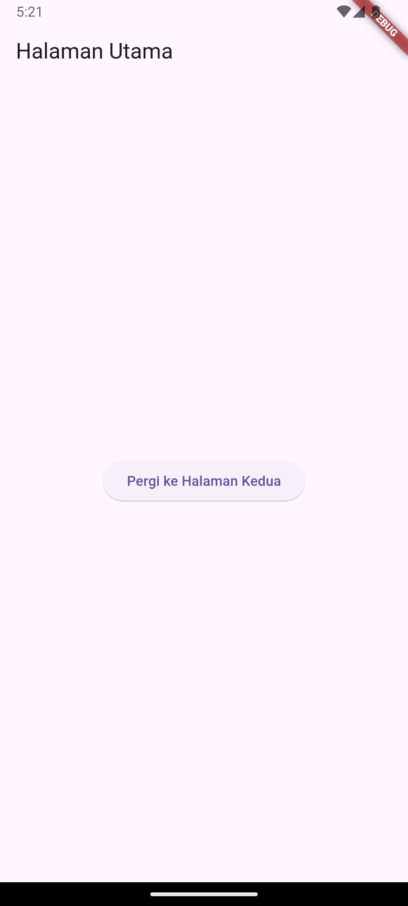
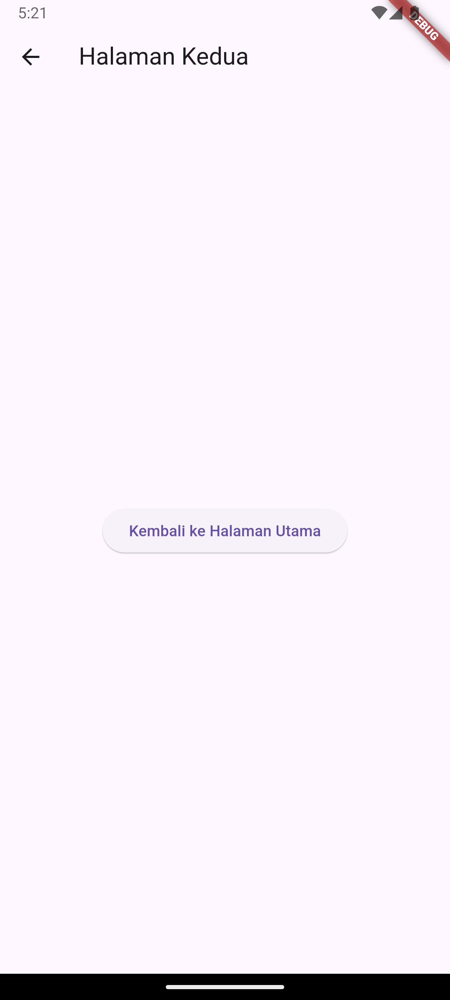

# TUGAS PENDAHULUAN

a. Buatlah satu project baru, yang mana di dalamnya terdapat navigasi untuk pindah dari satu halaman ke halaman lainnya.

## Source Code

```
import 'package:flutter/material.dart';

void main() {
  runApp(MyApp());
}

class MyApp extends StatelessWidget {
  @override
  Widget build(BuildContext context) {
    return MaterialApp(
      title: 'Navigasi Flutter',
      theme: ThemeData(
        primarySwatch: Colors.blue,
      ),
      home: HomePage(),
    );
  }
}

class HomePage extends StatelessWidget {
  @override
  Widget build(BuildContext context) {
    return Scaffold(
      appBar: AppBar(
        title: Text('Halaman Utama'),
      ),
      body: Center(
        child: ElevatedButton(
          onPressed: () {
            // Pindah ke halaman kedua
            Navigator.push(
              context,
              MaterialPageRoute(builder: (context) => SecondPage()),
            );
          },
          child: Text('Pergi ke Halaman Kedua'),
        ),
      ),
    );
  }
}

class SecondPage extends StatelessWidget {
  @override
  Widget build(BuildContext context) {
    return Scaffold(
      appBar: AppBar(
        title: Text('Halaman Kedua'),
      ),
      body: Center(
        child: ElevatedButton(
          onPressed: () {
            // Kembali ke halaman sebelumnya
            Navigator.pop(context);
          },
          child: Text('Kembali ke Halaman Utama'),
        ),
      ),
    );
  }
}
```

## Screenshot Output




## Deskripsi Program

Aplikasi sederhana ini berisi dua halaman : halaman utama dan halaman kedua. Terdapat elevatedbutton untuk berpindah ke halaman kedua dan halaman utama. Navigasi antar halaman dibuat menggunakan `Navigator.push` dan `Navigator.pop`.