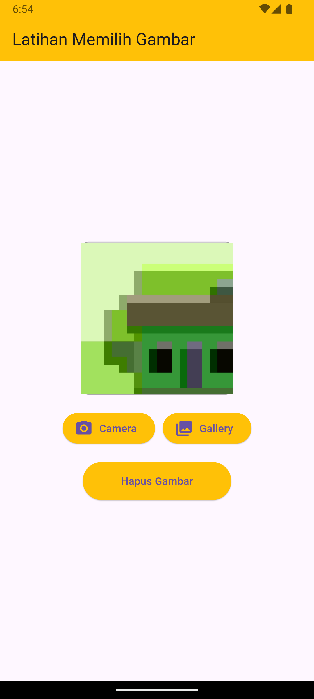

Praktikum Pertemuan ke 9 <br>
Adhitya Sofwan Al-Rasyid <br>
2211104089
# **NAVIGASI NOTIFIKASI**

# GUIDED

## Camera API

Camera API berfungsi untuk memungkinkan developer (pengembang) untuk mengakses dan mengontrol kamera perangkat. Flutter menyediakan paket camera yang memudahkan implementasi fitur kamera untuk mengambil foto, merekam video, dan mengakses umpan kamera secara langsung. Paket ini sangat berguna untuk membuat aplikasi yang membutuhkan pengambilan gambar atau video, seperti aplikasi media sosial atau e-commerce.

memasang dependency camera :
```
dependencies:
  flutter:
    sdk: flutter

  cupertino_icons: ^1.0.8
  camera: ^0.11.0+2
```

izin akses pada AndroidManifest.xml :
```
<manifest xmlns:android="http://schemas.android.com/apk/res/android">
    <uses-permission android:name="android.permission.CAMERA" />
    <uses-feature android:name="android.hardware.camera" />
```

mengubah versi minimum android sdk ke 21 :
```
defaultConfig {
        minSdkVersion 21
    }
```

### Implementasi Camera pada Flutter

camera_screen.dart
```
import 'package:flutter/material.dart';
import 'package:camera/camera.dart';
import 'package:prak09/display_screen.dart';

class MyCameraScreen extends StatefulWidget {
  const MyCameraScreen({super.key});

  @override
  State<MyCameraScreen> createState() => _MyCameraScreenState();
}

class _MyCameraScreenState extends State<MyCameraScreen> {
  late CameraController _controller;
  Future<void>? _initializeControllerFuture;

  Future<void> _initializeCamera() async {
    final cameras = await availableCameras();
    final firstCamera = cameras.first;

    _controller = CameraController(firstCamera, ResolutionPreset.high);

    _initializeControllerFuture = _controller.initialize();
    setState(() {});
  }

  @override
  void initState() {
    _initializeCamera();
    super.initState();
  }

  @override
  void dispose() {
    _controller.dispose();
    super.dispose();
  }

  Widget build(BuildContext context) {
    return Scaffold(
      appBar: AppBar(
        title: Text("Camera Impelementation"),
        centerTitle: true,
        actions: const [],
      ),
      body: FutureBuilder(
        future: _initializeControllerFuture,
        builder: (context, snapshot) {
          if (snapshot.connectionState == ConnectionState.done) {
            return CameraPreview(_controller);
          } else {
            return Center(child: CircularProgressIndicator());
          }
        },
      ),
      floatingActionButton: FloatingActionButton(
        child: const Icon(Icons.camera),
        onPressed: () async {
          try {
            await _initializeControllerFuture;
            final image = await _controller.takePicture();
            Navigator.push(
                context,
                MaterialPageRoute(
                    builder: (_) => DisplayScreen(imagePath: image.path)));
          } catch (e) {
            print(e);
          }
        },
      ),
    );
  }
}
```

display_screen.dart
```
import 'package:flutter/material.dart';
import 'dart:io';

class DisplayScreen extends StatelessWidget {
  // mulai dari sini
  final String imagePath;

  const DisplayScreen({
    super.key,
    required this.imagePath,
  });

  @override
  Widget build(BuildContext context) {
    return Scaffold(
      appBar: AppBar(
        title: Text('Display Screen'),
        centerTitle: true,
        backgroundColor: Colors.greenAccent,
      ),
      body: Image.file(File(imagePath)),
    );
  }
}
```

main.dart
```
import 'package:flutter/material.dart';
import 'package:prak09/camera_screen.dart';

void main() {
  runApp(const MyApp());
}

class MyApp extends StatelessWidget {
  const MyApp({super.key});

  @override
  Widget build(BuildContext context) {
    return MaterialApp(
      debugShowCheckedModeBanner: false,
      title: 'Flutter Demo',
      theme: ThemeData(
        
        colorScheme: ColorScheme.fromSeed(seedColor: Colors.deepPurple),
        useMaterial3: true,
      ),
      home: const MyCameraScreen(),
    );
  }
}
```

output :


## Media API

Media API adalah sekumpulan alat dan pustaka yang mendukung pengelolaan dan interaksi dengan berbagai jenis media, seperti gambar, video, dan audio. Flutter tidak memiliki API media bawaan untuk semua kebutuhan media, tetapi dapat menggunakan paket-paket tambahan untuk mengakses fitur media yang umum di aplikasi. 

Pada bahasan kali ini, kita akan menggunakan packages atau plugin Image Picker supaya aplikasi dapat mengakses media galeri pada device.

dependency :
```
dependencies:
  flutter:
    sdk: flutter
  cupertino_icons: ^1.0.8
  camera: ^0.11.0+2
  image_picker: ^1.1.2
```

izin akses pada AndroidManifest.xml :
```
<manifest xmlns:android="http://schemas.android.com/apk/res/android">
    <uses-permission android:name="android.permission.CAMERA" />
    <uses-feature android:name="android.hardware.camera" />
```

mengubah versi minimum android sdk ke 21 :
```
defaultConfig {
        minSdkVersion 21
    }
```

### Implementasi Image Picker pada Flutter

image_picker_screen.dart
```
import 'dart:io';
import 'package:flutter/material.dart';
import 'package:image_picker/image_picker.dart';

class ImagePickerScreen extends StatefulWidget {
  final ImageSourceType type;

  const ImagePickerScreen(this.type, {Key? key}) : super(key: key);

  @override
  State<ImagePickerScreen> createState() => _ImagePickerScreenState(this.type);
}

class _ImagePickerScreenState extends State<ImagePickerScreen> {
  File? _image;
  late ImagePicker imagePicker;
  final ImageSourceType type;

  _ImagePickerScreenState(this.type);

  @override
  void initState() {
    super.initState();
    imagePicker = ImagePicker();
  }

  @override
  Widget build(BuildContext context) {
    return Scaffold(
      appBar: AppBar(
        title: Text(type == ImageSourceType.camera
            ? "Image from Camera"
            : "Image from Gallery"),
      ),
      body: Column(
        children: [
          SizedBox(
            height: 52,
          ),
          Center(
              // Mengambil gambar dari kamera atau galeri
              child: GestureDetector(
                  onTap: () async {
                    // Operasi ternary untuk memilih sumber gambar
                    var source = type == ImageSourceType.camera
                        ? ImageSource.camera
                        : ImageSource.gallery;

                    // Menyimpan gambar pada variabel image
                    XFile? image = await imagePicker.pickImage(
                      source: source,
                      imageQuality: 50,
                      preferredCameraDevice: CameraDevice.front,
                    );
                    if (image != null) {
                      setState(() {
                        _image = File(image.path);
                      });
                    }
                  },
                  child: Container(
                    width: 200,
                    height: 200,
                    decoration: BoxDecoration(
                      color: Colors.red[200],
                    ),

                    // Menampilkan gambar dari kamera atau galeri
                    child: _image != null
                        ? Image.file(
                            _image!,
                            width: 200.0,
                            height: 200.0,
                            fit: BoxFit.fitHeight,
                          )

                        // Jika tidak ada gambar yang dipilih
                        : Container(
                            decoration: BoxDecoration(
                              color: Colors.red[200],
                            ),
                            width: 200,
                            height: 200,
                            child: Icon(
                              Icons.camera_alt,
                              color: Colors.grey[800],
                            ),
                          ),
                  )))
        ],
      ),
    );
  }
}

enum ImageSourceType { camera, gallery }
```

main.dart (mengambil dari kamera)
```
import 'package:flutter/material.dart';
import 'package:prak09/image_picker_screen.dart';

void main() {
  runApp(const MyApp());
}

class MyApp extends StatelessWidget {
  const MyApp({super.key});

  @override
  Widget build(BuildContext context) {
    return MaterialApp(
      debugShowCheckedModeBanner: false,
      title: 'Flutter Demo',
      theme: ThemeData(
        
        colorScheme: ColorScheme.fromSeed(seedColor: Colors.deepPurple),
        useMaterial3: true,
      ),
      home: const ImagePickerScreen(ImageSourceType.camera),
    );
  }
}
```

output :


main.dart (mengambil dari galery)
```
import 'package:flutter/material.dart';
import 'package:prak09/image_picker_screen.dart';

void main() {
  runApp(const MyApp());
}

class MyApp extends StatelessWidget {
  const MyApp({super.key});

  @override
  Widget build(BuildContext context) {
    return MaterialApp(
      debugShowCheckedModeBanner: false,
      title: 'Flutter Demo',
      theme: ThemeData(
        
        colorScheme: ColorScheme.fromSeed(seedColor: Colors.deepPurple),
        useMaterial3: true,
      ),
      home: const ImagePickerScreen(ImageSourceType.gallery),
    );
  }
}
```

output :


# =======================

# UNGUIDED

1. (Soal) Modifikasi project pemilihan gambar yang telah dikerjakan pada Tugas Pendahuluan Modul 09 agar fungsionalitas tombol dapat berfungsi untuk mengunggah gambar.
- Ketika tombol Gallery ditekan, aplikasi akan mengambil gambar dari galeri, dan setelah gambar dipilih, gambar tersebut akan ditampilkan di dalam container. 
- Ketika tombol Camera ditekan, aplikasi akan mengambil gambar menggunakan kamera, dan setelah pengambilan gambar selesai, gambar tersebut akan ditampilkan di dalam container. 
- Ketika tombol Hapus Gambar ditekan, gambar yang ada pada container akan dihapus.


## Source Code

dependency :
```
dependencies:
  flutter:
    sdk: flutter
  cupertino_icons: ^1.0.8
  camera: ^0.11.0+2
  image_picker: ^1.1.2
```

izin akses pada AndroidManifest.xml :
```
<manifest xmlns:android="http://schemas.android.com/apk/res/android">
    <uses-permission android:name="android.permission.CAMERA" />
    <uses-feature android:name="android.hardware.camera" />
```

mengubah versi minimum android sdk ke 21 :
```
defaultConfig {
        minSdkVersion 21
    }
```

kode :
```
import 'package:flutter/material.dart';
import 'package:image_picker/image_picker.dart';
import 'dart:io';

void main() {
  runApp(MyApp());
}

class MyApp extends StatelessWidget {
  @override
  Widget build(BuildContext context) {
    return MaterialApp(
      debugShowCheckedModeBanner: false,
      home: ImageSelectionScreen(),
    );
  }
}

class ImageSelectionScreen extends StatefulWidget {
  @override
  _ImageSelectionScreenState createState() => _ImageSelectionScreenState();
}

class _ImageSelectionScreenState extends State<ImageSelectionScreen> {
  File? _selectedImage; // Untuk menyimpan gambar yang dipilih
  final ImagePicker _picker = ImagePicker();

  Future<void> _pickImageFromCamera() async {
    final pickedFile = await _picker.pickImage(source: ImageSource.camera);
    if (pickedFile != null) {
      setState(() {
        _selectedImage = File(pickedFile.path);
      });
    }
  }

  Future<void> _pickImageFromGallery() async {
    final pickedFile = await _picker.pickImage(source: ImageSource.gallery);
    if (pickedFile != null) {
      setState(() {
        _selectedImage = File(pickedFile.path);
      });
    }
  }

  void _clearImage() {
    setState(() {
      _selectedImage = null;
    });
  }

  @override
  Widget build(BuildContext context) {
    return Scaffold(
      appBar: AppBar(
        title: Text("Latihan Memilih Gambar"),
        backgroundColor: Colors.amber,
      ),
      body: Padding(
        padding: const EdgeInsets.all(16.0),
        child: Column(
          mainAxisAlignment: MainAxisAlignment.center,
          children: [
            Container(
              height: 200,
              width: 200,
              decoration: BoxDecoration(
                border: Border.all(color: Colors.grey),
                borderRadius: BorderRadius.circular(10),
              ),
              child: _selectedImage != null
                  ? Image.file(_selectedImage!, fit: BoxFit.cover)
                  : Icon(
                      Icons.image_outlined,
                      size: 100,
                      color: Colors.grey,
                    ),
            ),
            SizedBox(height: 20),
            Row(
              mainAxisAlignment: MainAxisAlignment.center,
              children: [
                ElevatedButton.icon(
                  onPressed: _pickImageFromCamera,
                  icon: Icon(Icons.camera_alt),
                  label: Text("Camera"),
                  style: ElevatedButton.styleFrom(backgroundColor: Colors.amber),
                ),
                SizedBox(width: 10),
                ElevatedButton.icon(
                  onPressed: _pickImageFromGallery,
                  icon: Icon(Icons.photo_library),
                  label: Text("Gallery"),
                  style: ElevatedButton.styleFrom(backgroundColor: Colors.amber),
                ),
              ],
            ),
            SizedBox(height: 20),
            ElevatedButton(
              onPressed: _clearImage,
              child: Text("Hapus Gambar"),
              style: ElevatedButton.styleFrom(
                backgroundColor: Colors.amber,
                padding: EdgeInsets.symmetric(horizontal: 50, vertical: 15),
              ),
            ),
          ],
        ),
      ),
    );
  }
}
```

## Output

Tampilan awal


Tombol Camera




Tombol Gallery


Tombol Hapus Gambar


## Deskripsi Program

Aplikasi ini adalah modifikasi dari tugas TP09, dengan menambahkan fungsi pada setiap button. Button `camera` memiliki fungsi untuk mengambil gambar langsung dari kamera, button `gallery` memiliki fungsi untuk mengambil gambar dari galeri, kemudian button `hapus gambar` memiliki fungsi untuk menghapus gambar yang sedang ditampilkan.
