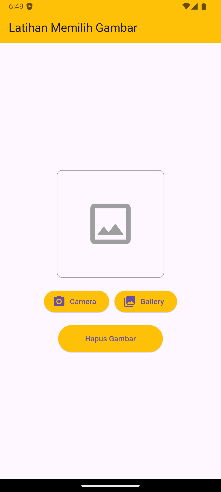

# TUGAS PENDAHULUAN

a. Buatlah satu project baru, yang mana di dalamnya memuat container berisi Icons.image_outlined, button camera, button gallery dan button hapus gambar.
Button tidak harus berfungsi.

## Source Code

```
import 'package:flutter/material.dart';

void main() {
  runApp(MyApp());
}

class MyApp extends StatelessWidget {
  @override
  Widget build(BuildContext context) {
    return MaterialApp(
      home: ImageSelectionScreen(),
    );
  }
}

class ImageSelectionScreen extends StatelessWidget {
  @override
  Widget build(BuildContext context) {
    return Scaffold(
      appBar: AppBar(
        title: Text("Latihan Memilih Gambar"),
        backgroundColor: Colors.amber,
      ),
      body: Padding(
        padding: const EdgeInsets.all(16.0),
        child: Column(
          mainAxisAlignment: MainAxisAlignment.center,
          children: [
            Container(
              height: 200,
              width: 200,
              decoration: BoxDecoration(
                border: Border.all(color: Colors.grey),
                borderRadius: BorderRadius.circular(10),
              ),
              child: Icon(
                Icons.image_outlined,
                size: 100,
                color: Colors.grey,
              ),
            ),
            SizedBox(height: 20),
            Row(
              mainAxisAlignment: MainAxisAlignment.center,
              children: [
                ElevatedButton.icon(
                  onPressed: () {},
                  icon: Icon(Icons.camera_alt),
                  label: Text("Camera"),
                  style: ElevatedButton.styleFrom(backgroundColor: Colors.amber),
                ),
                SizedBox(width: 10),
                ElevatedButton.icon(
                  onPressed: () {},
                  icon: Icon(Icons.photo_library),
                  label: Text("Gallery"),
                  style: ElevatedButton.styleFrom(backgroundColor: Colors.amber),
                ),
              ],
            ),
            SizedBox(height: 20),
            ElevatedButton(
              onPressed: () {},
              child: Text("Hapus Gambar"),
              style: ElevatedButton.styleFrom(
                backgroundColor: Colors.amber,
                padding: EdgeInsets.symmetric(horizontal: 50, vertical: 15),
              ),
            ),
          ],
        ),
      ),
    );
  }
}
```

## Screenshot Output



## Deskripsi Program

Pada halaman utama aplikasi, terdapat ikon gambar di tengah dalam sebuah kontainer, yang akan digantikan oleh gambar yang dipilih oleh pengguna. Aplikasi ini juga menyediakan tiga tombol: tombol `Camera` untuk membuka kamera, tombol `Gallery` untuk memilih gambar dari galeri, dan tombol `Hapus Gambar` untuk menghapus gambar yang dipilih dan mengembalikan ikon gambar default.