Praktikum Pertemuan ke 10 <br>
Adhitya Sofwan Al-Rasyid <br>
2211104089
# **DATA STORAGE (BAGIAN 1)**

# GUIDED

## Pengenalan SQLite

SQLite adalah database relasional yang merupakan penyimpanan data secara offline untuk sebuah mobile app (pada local storage, lebih tepatnya pada cache memory aplikasi). SQLite memiliki CRUD (create, read, update dan delete). Empat operasi tersebut penting dalam sebuah penyimpanan. Untuk struktur database pada SQLite, sama seperti SQL pada umumnya, variabel dan tipe data yang dimiliki tidak jauh berbeda dengan SQL.

## SQL Helper Dasar

Dalam Flutter, SQL Helper biasanya merujuk pada penggunaan paket seperti sqflite untuk mengelola database SQLite. SQL Helper merupakan class untuk membuat beberapa method yang berkaitan dengan perubahan data. sqflite adalah plugin Flutter yang memungkinkan untuk melakukan operasi CRUD (Create, Read, Update, Delete) pada database SQLite.

### Read

Di package sqflite, kita akan menggunakan query() untuk membaca data yang ada pada database. Sqflite di Flutter kita dapat membuat query menggunakan bermacam-macam perintah, seperti where, groupBy, orderBy, dan having. Selain itu, kita juga bisa membaca satu data atau banyak data sekaligus.


Tambahkan plugin sqflite dan path :
```
dependencies:
  flutter:
    sdk: flutter
  cupertino_icons: ^1.0.8
  sqflite: ^2.4.1
  path: ^1.9.0
```

db_helper.dart
```
import 'package:sqflite/sqflite.dart';
import 'package:path/path.dart';

// Kelas DatabaseHelper untuk mengelola database
class DatabaseHelper {
  static final DatabaseHelper _instance = DatabaseHelper._internal();
  static Database? _database;

  // Factory constructor untuk mengembalikan instance singleton
  factory DatabaseHelper() {
    return _instance;
  }

  // Private Constructor
  DatabaseHelper._internal();


  // Getter
  Future<Database> get database async{
    if(_database != null) return _database!;
    {
      _database = await _initDatabase();
      return _database!;
    }
  }

  Future<Database> _initDatabase() async{
    // Mendapatkan path untuk database
    String path = join(await getDatabasesPath(),
    'my_prakdatabase.db');
    // Membuka database
    return await openDatabase(
      path,
      version: 1,
      onCreate: _onCreate,
      );
  }

  Future<void> _onCreate(Database db, int version) async{
    await db.execute('''
  CREATE TABLE my_table(
  id INTEGER PRIMARY KEY AUTOINCREMENT NOT NULL,
  title TEXT,
  description TEXT,
  createdAt TIMESTAMP NOT NULL DEFAULT CURRENT_TIMESTAMP)
  ''');
  }

  Future<int> insert(Map<String, dynamic> row)async{
    Database db = await database;
    return await db.insert('my_table', row);
  }

  // Metode untuk mengambil semua data dari table
  Future<List<Map<String, dynamic>>> queryAllRows() async{
    Database db = await database;
    return await db.query('my_table');
  }

  // Metode untuk mengupdate data dari table
  Future<int> update(Map<String, dynamic> row) async{
    Database db = await database;
    int id = row['id'];
    return await db.update('my_table', row, where: 'id = ?', whereArgs: [id]);
  }

  Future<int> delete(int id) async{
    Database db = await database;
    return await db.delete('my_table', where: 'id = ?', whereArgs: [id]);
  }
}
```

my_db_view.dart
```
import 'package:flutter/material.dart';
import 'package:prak10/helper/db_helper.dart';

class MyDatabaseView extends StatefulWidget {
  const MyDatabaseView({super.key});

  @override
  State<MyDatabaseView> createState() => _MyDatabaseViewState();
}

class _MyDatabaseViewState extends State<MyDatabaseView> {
  final DatabaseHelper dbHelper = DatabaseHelper();
  List<Map<String, dynamic>> _dbData = [];
  final TextEditingController _titleController = TextEditingController();
  final TextEditingController _descriptionController = TextEditingController();

  @override
  void initState(){
    _refreshData();
    super.initState();
  }

  @override
  void dispose() {
    _titleController.dispose();
    _descriptionController.dispose();
    super.dispose();
  }

  // Metode untuk memperbarui data dari database
  void _refreshData() async{
    final data = await dbHelper.queryAllRows();
    setState(() {
    _dbData = data;
    });
  }

  // Metode untuk menambahkan data ke database
  void _addData() async{
    await dbHelper.insert({
      'title' : _titleController.text,
      'description' : _descriptionController.text,
    });
    _titleController.clear();
    _descriptionController.clear();
    _refreshData();
  }

  // Metode untuk mengupdate data di database
  void _updateData(int id) async{
    await dbHelper.update({
      'id': id,
      'title': _titleController.text,
      'description': _descriptionController.text,
    });
    _titleController.clear();
    _descriptionController.clear();
    _refreshData();
  }

  // Metode untuk menghapus data dari database
  void _deleteData(int id) async{
    await dbHelper.delete(id);
    _refreshData();
  }

  // Menampilkan dialog untuk mengedit data
  void _showEditDialog(Map<String, dynamic> item) {
    _titleController.text = item['title'];
    _descriptionController.text = item['description'];

    showDialog(
      context: context,
      builder: (context) {
        return AlertDialog(
          title: Text('Edit Item'),
          content: Column(
            mainAxisSize: MainAxisSize.min,
            children: [
              TextField(
                controller: _titleController,
                decoration: InputDecoration(
                  labelText: 'Title',
                ),
              ),
              
              TextField(
                controller: _descriptionController,
                decoration: InputDecoration(
                  labelText: 'Description',
                ),
              ),
            ],
          ),
          actions: [
            TextButton(
              onPressed: () {
                Navigator.of(context).pop();
              },
              child: Text('Cancel'),
            ),
            TextButton(
              onPressed: () {
                _updateData(item['id']);
                Navigator.of(context).pop();
              },
              child: Text('Save'),
            ),
          ],
        );
      },
    );
  }

  @override
  Widget build(BuildContext context) {
    return Scaffold(
      appBar: AppBar(
        title: Text(
          'Praktikum Database - sqflite',
        ),
        backgroundColor: Colors.blueAccent,
        centerTitle: true,
      ),
      body: Column(
        children: [
          Padding(
            padding: const EdgeInsets.all(8.0),
            child: TextField(
              controller: _titleController,
              decoration: InputDecoration(
                labelText: 'Title',
              ),
            ),
          ),
          Padding(
            padding: const EdgeInsets.all(8.0),
            child: TextField(
              controller: _descriptionController,
              decoration: InputDecoration(
                labelText: 'Description',
              ),
            ),
          ),
          ElevatedButton(
            onPressed: _addData,
            child: Text('Add Data'),
          ),
          Expanded(
            child: ListView.builder(
              itemCount: _dbData.length,
              itemBuilder: (context, index) {
                final item = _dbData[index];
                return ListTile(
                  title: Text(item['title']),
                  subtitle: Text(item['description']),
                  trailing: Row(
                    mainAxisSize: MainAxisSize.min,
                    children: [
                      IconButton(
                        icon: Icon(Icons.edit),
                        onPressed: () => _showEditDialog(item),
                      ),
                      IconButton(
                        icon: Icon(Icons.delete),
                        onPressed: () => _deleteData(item['id']),
                      ),
                    ],
                  ),
                );
              },
            ),
          )
        ],
      ),
    );
  }
}
```

main.dart
```
import 'package:flutter/material.dart';
import 'package:prak10/view/my_db_view.dart';

void main() {
  runApp(const MyApp());
}

class MyApp extends StatelessWidget {
  const MyApp({super.key});

  @override
  Widget build(BuildContext context) {
        return MaterialApp(
      debugShowCheckedModeBanner: false,
      home: MyDatabaseView()
    );
  }
}
```

output :

Tampilan awal :
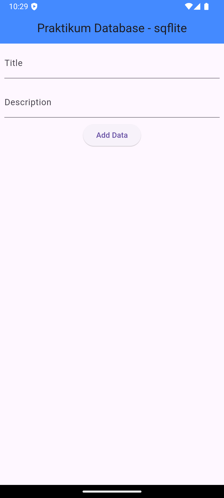

Add data :
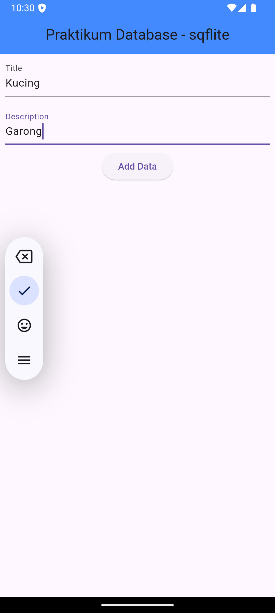
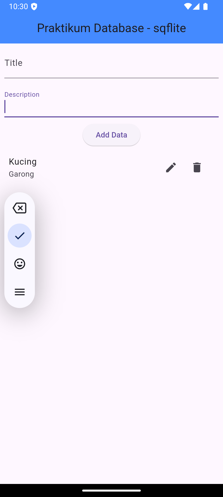

Edit data :
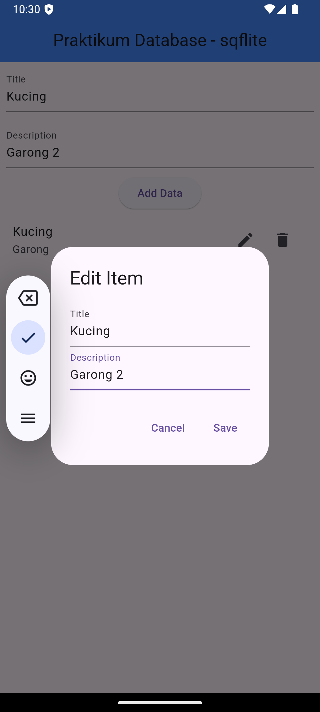
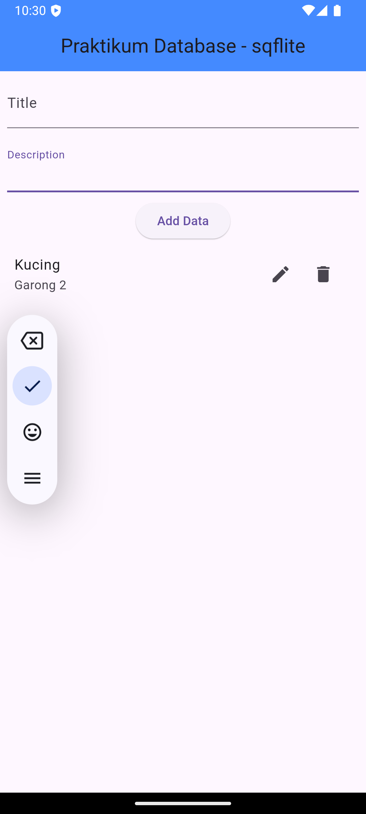

Hapus data :


# =======================

# UNGUIDED

## Buatlah sebuah project aplikasi Flutter dengan SQLite untuk menyimpan data biodata mahasiswa yang terdiri dari nama, NIM, domisili, dan hobi. Data yang dimasukkan melalui form akan ditampilkan dalam daftar di halaman utama. Alur Aplikasi:

  ### 1. Form Input: Buat form input untuk menambahkan biodata mahasiswa, dengan kolom:
  - Nama
  - Nim
  - Alamat
  - Hobi

  ### 2. Tampilkan Daftar Mahasiswa: Setelah data berhasil ditambahkan, tampilkan daftar semua data mahasiswa yang sudah disimpan di halaman utama.

  ### 3. Implementasikan fitur Create (untuk menyimpan data mahasiswa) dan Read (untuk menampilkan daftar mahasiswa yang sudah disimpan).

  ### Contoh Output :
  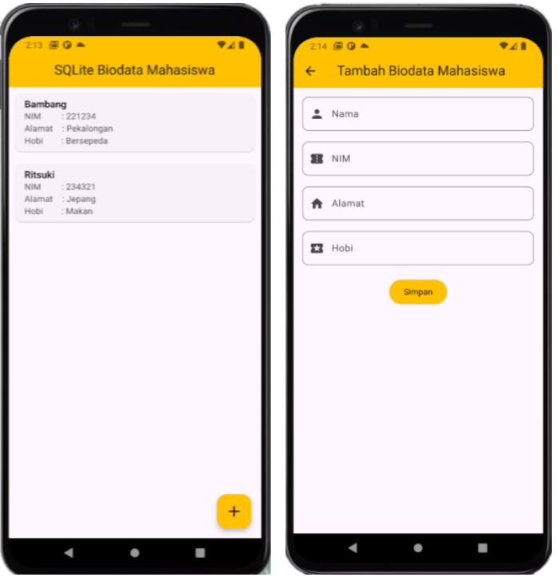


## Source Code

tambahkan dependency sqflite dan path :
```
dependencies:
  flutter:
    sdk: flutter
  cupertino_icons: ^1.0.8
  sqflite: ^2.4.1
  path: ^1.9.0
```

model mahasiswa :
```
class Mahasiswa {
  int? id;
  String nama;
  String nim;
  String alamat;
  String hobi;

  Mahasiswa({this.id, required this.nama, required this.nim, required this.alamat, required this.hobi});

  // Convert Mahasiswa to Map
  Map<String, dynamic> toMap() {
    return {
      'id': id,
      'nama': nama,
      'nim': nim,
      'alamat': alamat,
      'hobi': hobi,
    };
  }

  // Convert Map to Mahasiswa
  static Mahasiswa fromMap(Map<String, dynamic> map) {
    return Mahasiswa(
      id: map['id'],
      nama: map['nama'],
      nim: map['nim'],
      alamat: map['alamat'],
      hobi: map['hobi'],
    );
  }
}
```

db_helper.dart
```
import 'package:sqflite/sqflite.dart';
import 'package:path/path.dart';
import 'package:prak10/model/mahasiswa.dart';

class DBHelper {
  static final DBHelper _instance = DBHelper._internal();
  factory DBHelper() => _instance;
  DBHelper._internal();

  static Database? _database;

  Future<Database> get database async {
    if (_database != null) return _database!;
    _database = await _initDatabase();
    return _database!;
  }

  Future<Database> _initDatabase() async {
    final dbPath = await getDatabasesPath();
    return await openDatabase(
      join(dbPath, 'mahasiswa.db'),
      onCreate: (db, version) async {
        await db.execute('''
          CREATE TABLE mahasiswa(
            id INTEGER PRIMARY KEY AUTOINCREMENT,
            nama TEXT,
            nim TEXT,
            alamat TEXT,
            hobi TEXT
          )
        ''');
      },
      version: 1,
    );
  }

  Future<void> insertMahasiswa(Mahasiswa mahasiswa) async {
    final db = await database;
    await db.insert('mahasiswa', mahasiswa.toMap());
  }

  Future<List<Mahasiswa>> getMahasiswa() async {
    final db = await database;
    final List<Map<String, dynamic>> maps = await db.query('mahasiswa');
    return List.generate(maps.length, (i) => Mahasiswa.fromMap(maps[i]));
  }
}
```

input_page.dart
```
import 'package:flutter/material.dart';
import 'package:prak10/helper/db_helper.dart';
import 'package:prak10/model/mahasiswa.dart';

class InputPage extends StatefulWidget {
  @override
  _InputPageState createState() => _InputPageState();
}

class _InputPageState extends State<InputPage> {
  final _formKey = GlobalKey<FormState>();
  final TextEditingController _namaController = TextEditingController();
  final TextEditingController _nimController = TextEditingController();
  final TextEditingController _alamatController = TextEditingController();
  final TextEditingController _hobiController = TextEditingController();

  void _simpanData() async {
    if (_formKey.currentState!.validate()) {
      final mahasiswa = Mahasiswa(
        nama: _namaController.text,
        nim: _nimController.text,
        alamat: _alamatController.text,
        hobi: _hobiController.text,
      );
      await DBHelper().insertMahasiswa(mahasiswa);
      Navigator.pop(context);
    }
  }

  @override
  Widget build(BuildContext context) {
    return Scaffold(
      appBar: AppBar(title: Text('Tambah Biodata Mahasiswa')),
      body: Padding(
        padding: const EdgeInsets.all(16.0),
        child: Form(
          key: _formKey,
          child: Column(
            children: [
              TextFormField(
                controller: _namaController,
                decoration: InputDecoration(labelText: 'Nama'),
                validator: (value) => value!.isEmpty ? 'Nama tidak boleh kosong' : null,
              ),
              TextFormField(
                controller: _nimController,
                decoration: InputDecoration(labelText: 'NIM'),
                validator: (value) => value!.isEmpty ? 'NIM tidak boleh kosong' : null,
              ),
              TextFormField(
                controller: _alamatController,
                decoration: InputDecoration(labelText: 'Alamat'),
                validator: (value) => value!.isEmpty ? 'Alamat tidak boleh kosong' : null,
              ),
              TextFormField(
                controller: _hobiController,
                decoration: InputDecoration(labelText: 'Hobi'),
                validator: (value) => value!.isEmpty ? 'Hobi tidak boleh kosong' : null,
              ),
              SizedBox(height: 20),
              ElevatedButton(
                onPressed: _simpanData,
                child: Text('Simpan'),
              )
            ],
          ),
        ),
      ),
    );
  }
}
```

homepage.dart
```
import 'package:flutter/material.dart';
import 'package:prak10/helper/db_helper.dart';
import 'package:prak10/model/mahasiswa.dart';
import 'input_page.dart';

class HomePage extends StatefulWidget {
  @override
  _HomePageState createState() => _HomePageState();
}

class _HomePageState extends State<HomePage> {
  List<Mahasiswa> _mahasiswaList = [];

  void _loadData() async {
    final data = await DBHelper().getMahasiswa();
    setState(() {
      _mahasiswaList = data;
    });
  }

  @override
  void initState() {
    super.initState();
    _loadData();
  }

  @override
  Widget build(BuildContext context) {
    return Scaffold(
      appBar: AppBar(title: Text('SQLite Biodata Mahasiswa')),
      body: ListView.builder(
        itemCount: _mahasiswaList.length,
        itemBuilder: (context, index) {
          final mahasiswa = _mahasiswaList[index];
          return Card(
            child: ListTile(
              title: Text(mahasiswa.nama),
              subtitle: Column(
                crossAxisAlignment: CrossAxisAlignment.start,
                children: [
                  Text('NIM: ${mahasiswa.nim}'),
                  Text('Alamat: ${mahasiswa.alamat}'),
                  Text('Hobi: ${mahasiswa.hobi}'),
                ],
              ),
            ),
          );
        },
      ),
      floatingActionButton: FloatingActionButton(
        onPressed: () async {
          await Navigator.push(
            context,
            MaterialPageRoute(builder: (context) => InputPage()),
          );
          _loadData();
        },
        child: Icon(Icons.add),
      ),
    );
  }
}
```

main.dart
```
import 'package:flutter/material.dart';
import 'package:prak10/view/homepage.dart';

void main() {
  runApp(const MyApp());
}

class MyApp extends StatelessWidget {
  const MyApp({super.key});

  @override
  Widget build(BuildContext context) {
    return MaterialApp(
      debugShowCheckedModeBanner: false,
      title: 'Flutter Demo',
      theme: ThemeData(
        colorScheme: ColorScheme.fromSeed(seedColor: Colors.deepPurple),
        useMaterial3: true,
      ),
      home: HomePage(),
    );
  }
}
```

## Output

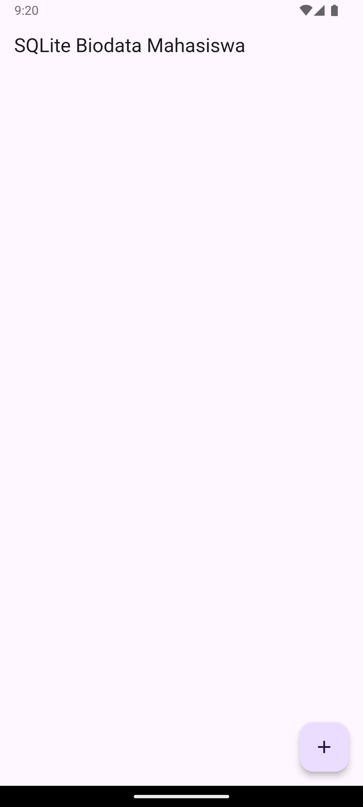
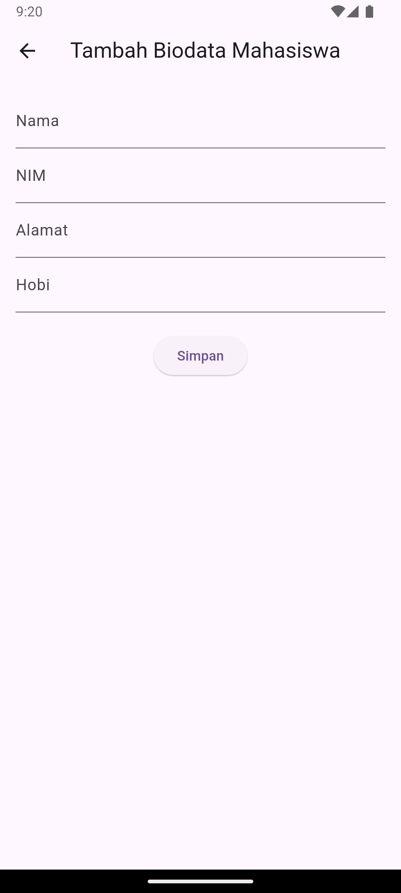
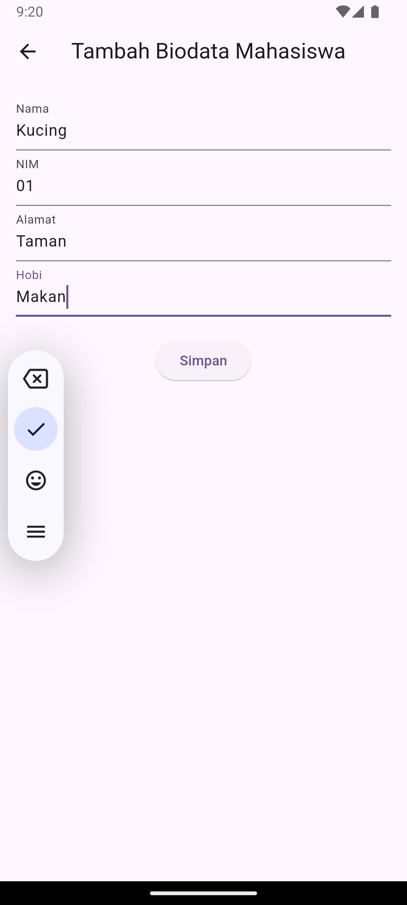
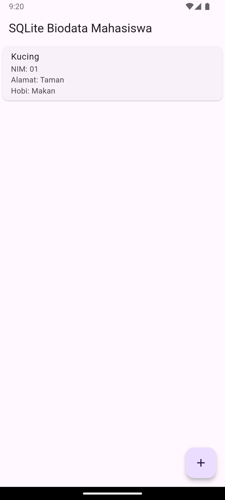
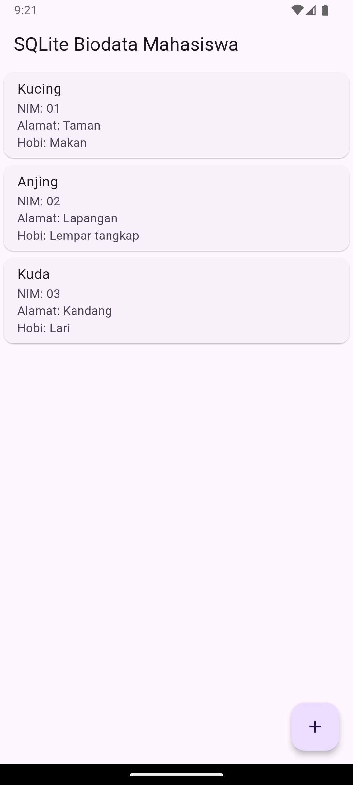


## Deskripsi Program

Aplikasi di atas adalah sebuah aplikasi Flutter sederhana yang menggunakan SQLite untuk menyimpan, membaca, dan menampilkan data biodata mahasiswa. Aplikasi ini memiliki fitur untuk menambahkan data mahasiswa melalui form input yang terdiri dari kolom nama, NIM, alamat, dan hobi. Data yang dimasukkan kemudian disimpan ke dalam database SQLite dan ditampilkan dalam bentuk daftar di halaman utama.