Praktikum Pertemuan ke 11 <br>
Adhitya Sofwan Al-Rasyid <br>
2211104089
# **FIREBASE NOTIFIKASI**

# GUIDED

## Firebase Cloud Messaging (FCM)

Firebase Cloud Messaging (FCM) adalah layanan yang digunakan untuk mengirimkan notifikasi dengan mudah ke banyak pengguna sekaligus. Dengan FCM, Kita dapat mengirimkan pesan baik ke perangkat individu maupun ke grup pengguna yang berlangganan topik tertentu. Dokumentasi lengkapnya dapat diakses di https://firebase.google.com/docs/flutter/setup?platform=android

Agar dapat mengirim pesan, Kita perlu:
1. Mendapatkan token unik dari setiap perangkat pengguna.
2. Atau mengelompokkan pengguna berdasarkan topik tertentu (misalnya "promo" atau "berita").

Setelah itu, notifikasi dapat dikirim menggunakan Firebase Cloud Functions.

## Jenis pesan pada FCM

FCM memiliki dua jenis pesan utama yang digunakan untuk kebutuhan notifikasi, yaitu:

1. Notification Message<br>
Pesan ini digunakan untuk langsung menampilkan notifikasi di perangkat pengguna.
Cara kerja:
- Jika aplikasi berjalan di latar depan (foreground), pesan diteruskan ke fungsi onMessage untuk diproses.
- Jika aplikasi di latar belakang (background) atau dimatikan (terminated), notifikasi akan langsung muncul di tray notifikasi perangkat tanpa memerlukan kode tambahan.

2. Data Message<br>
Pesan ini memberikan lebih banyak fleksibilitas karena isinya tidak langsung ditampilkan sebagai notifikasi.
Cara kerja:
- Pesan ini akan diproses oleh aplikasi, baik saat aplikasi aktif maupun tidak aktif.
- Untuk menampilkan notifikasi ke pengguna, Kita perlu menambahkan kode khusus, biasanya menggunakan plugin seperti flutter_local_notifications.

### Integrasi Aplikasi dengan Firebase

Untuk memulai, kita perlu menyiapkan akun di Firebase. Di bawah ini adalah langkah-langkah yang perlu kita ikuti untuk menyiapkan Google Firebase untuk notifikasi push di Android:

- Daftar dan login pada firebase console lalu buat sebuah projek baru.

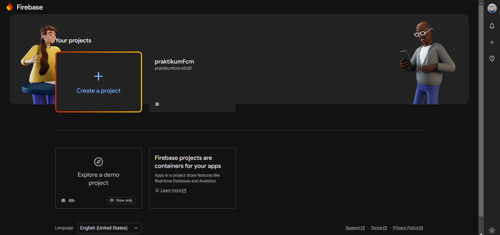

- Tambahkan android package name, app nickname and SHA-1 signing certificate key. Android package name dapat ditemukan di ./android/app/ build.gradle.

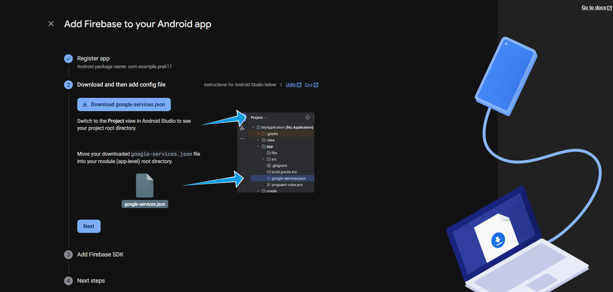

- Setelah berhasil mendaftarkan aplikasi ke firebase, download file google-services.json lalu simpan pada ./android/app/

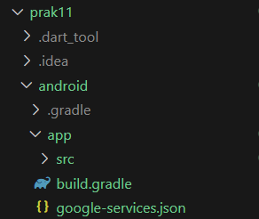

- Tambahkan plugin dan sdk sesuai perintah pada ./android/build.gradle dan ./android/app/build.gradle lalu lakukan sync dengan mengetik “flutter pub get” pada terminal.

menambahkan plugin pada android/build.gradle :
```
plugins {
  id 'com.google.gms.google-services' version '4.4.2' apply false
}
```

menambahkan plugin dan dependency pada android/app/build.gradle :
```
plugins {
    id "com.android.application"
    id "kotlin-android"
    id "dev.flutter.flutter-gradle-plugin"
    id 'com.google.gms.google-services' // ini yang ditambahkan
}

dependencies {
  implementation platform('com.google.firebase:firebase-bom:33.6.0') // tambahkan ini
  implementation 'com.google.firebase:firebase-analytics' // dan ini juga
}
```

- Setelah memodifikasi file build.gradle, tambahkan beberapa package pada file pubspec.yaml dengan mengetik “flutter pub add firebase_core firebase_messaging flutter_local_notifications” pada terminal.

```
dependencies:
  flutter:
    sdk: flutter
  cupertino_icons: ^1.0.8
  firebase_core: ^3.8.0
  firebase_messaging: ^15.1.5
  flutter_local_notifications: ^18.0.1
```

- Ubah compile sdk agar menggunakan versi 33 dan min sdk pada versi 21 yang terletak pada file ./android/app/build.gradle

```
defaultConfig {
        minSdkVersion 21
        targetSdkVersion 33
    }
```

### Membuat Notifikasi Handler

1. Pertama, tambahkan kode di fungsi main() untuk memastikan Firebase dan konfigurasi lainnya sudah siap digunakan

main.dart
```
void main() async {
  WidgetsFlutterBinding.ensureInitialized();
  await Firebase.initializeApp();

  FirebaseMessaging.onBackgroundMessage(_firebaseMessagingBackgroundHandler);

  await FlutterLocalNotificationsPlugin()

  .resolvePlatformSpecificImplementation<AndroidFlutterLocalNotificationsPlugin>()
  ?.createNotificationChannel(channel);

  await FirebaseMessaging.instance.setForegroundNotificationPresentationOptions(
  alert: true,
  badge: true,
  sound: true,
  );
  runApp(const MyApp());
}
```

2. Tambahkan kode berikut di bawah import sebagai variabel global.

main.dart (dibawah kode nomor 1)
```
String? token;
Future<void> _firebaseMessagingBackgroundHandler(RemoteMessage message)
async {
 await Firebase.initializeApp();
 print('Handling a background message: ${message.messageId}');
}
const AndroidNotificationChannel channel = AndroidNotificationChannel(
 'high_importance_channel', // ID Channel
 'High Importance Notifications', // Nama Channel
 description: 'This channel is used for important notifications.', // Deskripsi Channel
 importance: Importance.high, // Prioritas
);
```

3. Di dalam kelas State, tambahkan konfigurasi untuk menangani notifikasi

my_notification_screen.dart (diatas widget build)
```
class _MyNotificationScreenState extends State<MyNotificationScreen> {
  @override
  void initState() {
    super.initState();

    // Membuat pengaturan inisialisasi notifikasi untuk Android
    var initializationSettingsAndroid =
      const AndroidInitializationSettings('@mipmap/ic_launcher');
    var initializationSettings =
      InitializationSettings(android: initializationSettingsAndroid);
    FlutterLocalNotificationsPlugin().initialize(initializationSettings);

    // Mendengarkan pesan saat aplikasi aktif
    FirebaseMessaging.onMessage.listen((RemoteMessage message) {
      RemoteNotification? notification = message.notification;
      AndroidNotification? android = message.notification?.android;

      // Jika notifikasi tersedia, tampilkan menggunakan notifikasi lokal
      if (notification != null && android != null) {
        FlutterLocalNotificationsPlugin().show(
          notification.hashCode, // ID notifikasi (hashCode untuk unik)
          notification.title, // Judul notifikasi
          notification.body, // Isi notifikasi
          NotificationDetails(
            android: AndroidNotificationDetails(
              channel.id,
              channel.name,
              channelDescription: channel.description,
              color: Colors.blue,
              icon: "@mipmap/ic_launcher",
            ),
          ),
        );
      }
    });


    // Menangani aksi ketika notifikasi dibuka
    FirebaseMessaging.onMessageOpenedApp.listen((RemoteMessage message) {
      RemoteNotification? notification = message.notification;
      AndroidNotification? android = message.notification?.android;

    // Jika notifikasi tersedia, tampilkan dialog
    if (notification != null && android != null) {
      showDialog(
        context: context,
        builder: (_) {
          return AlertDialog(
            title: Text(notification.title ?? ""), // Judul dialog
            content: SingleChildScrollView(
              child: Column(
                crossAxisAlignment: CrossAxisAlignment.start,
                children: [Text(notification.body ?? "")], // Isi dialog
              ),
            ),
          );
        },
      );
    }
  });

  // Memanggil metode untuk mengambil token FCM perangkat
  getToken();
  }

// Metode untuk mendapatkan token FCM
  void getToken() async {
    token = await FirebaseMessaging.instance
      .getToken(); // Mendapatkan token FCM perangkat
    print('FCM Token: $token'); // Menampilkan token di log
  }
  
  @override
  Widget build(BuildContext context) {
    return Scaffold(
      appBar: AppBar(
        title: const Text('My Notification Screen'),
        backgroundColor: Colors.amber,
      ),
      body: const Center(child: Text('Halaman untuk menerima notifikasi'),),
    );
  }
}
```

### Mengirim Notifikasi via FCM Console

1. Gaskeun waktunya testing notifikasi kalian. Dimulai dengan membuka halaman all product pada tab firebase --> pilih menu cloud messaging --> lalu pilih send your first message.

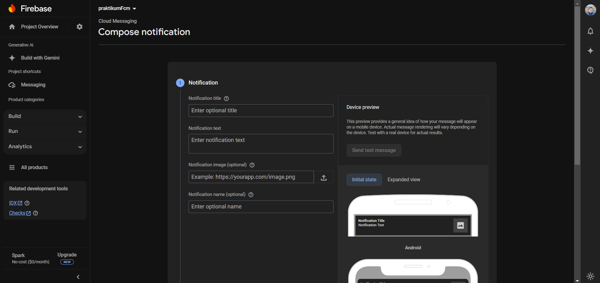

2. Selanjutnya, inputkan judul, pesan, dan foto dari notifikasi kalian sesuai dengan kebutuhan.

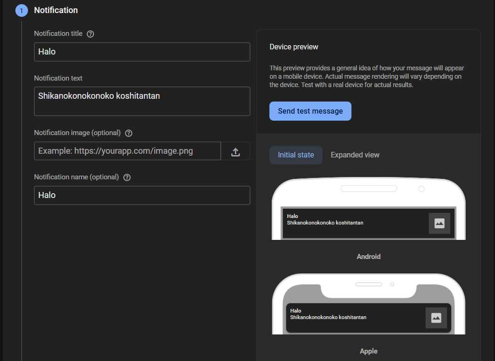

3. Setelah itu, pilih aplikasi mana yang akan dikirimkan notifikasi dan setting waktu "Now” jika ingin langsung mengirimkan notifikasi. Lalu klik publish jika isi dan settingan notifikasi sudah benar.

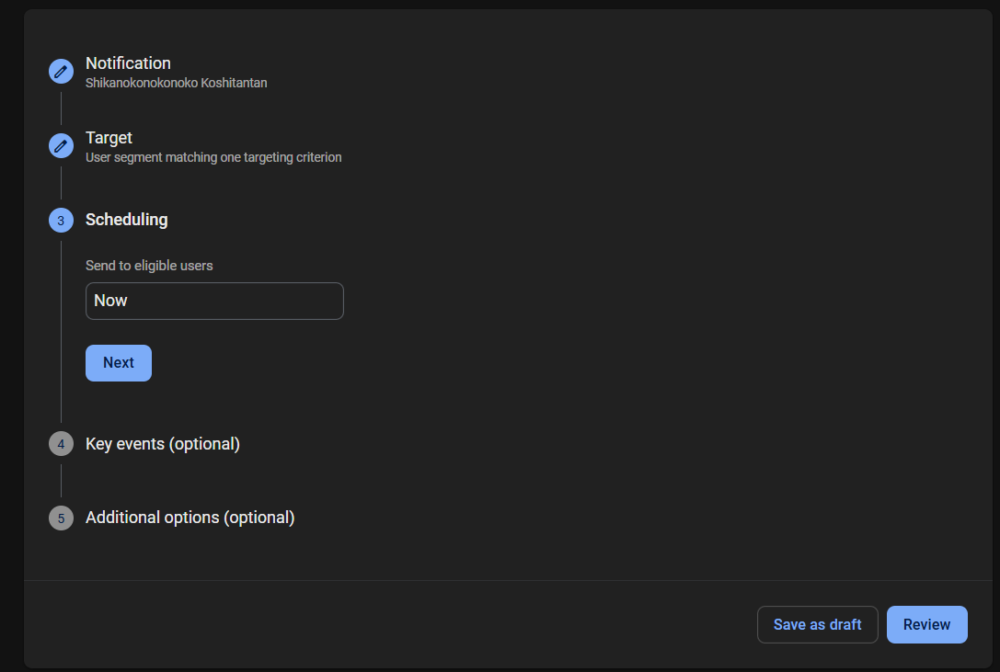
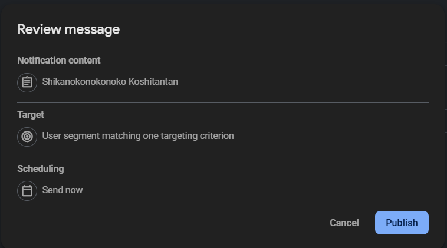

4. Silakan tunggu notifikasi muncul pada aplikasi. Catatan: pengiriman notifikasi memerlukan beberapa saat dan tidak akan langsung muncul setelah dikirim jadi silakan menunggu.

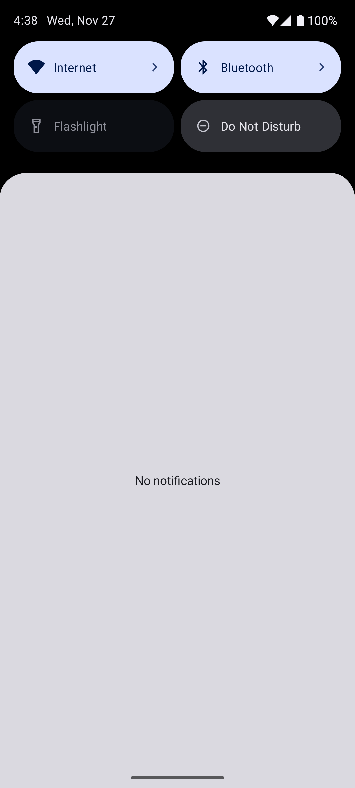

5. Klik notifikasi maka akan di redirect ke aplikasi dan akan menampilkan seperti pada gambar dibawah.

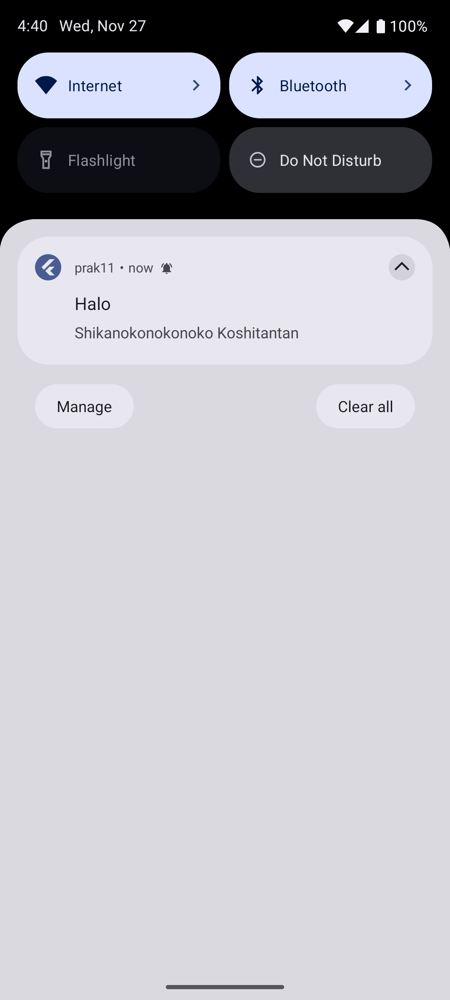
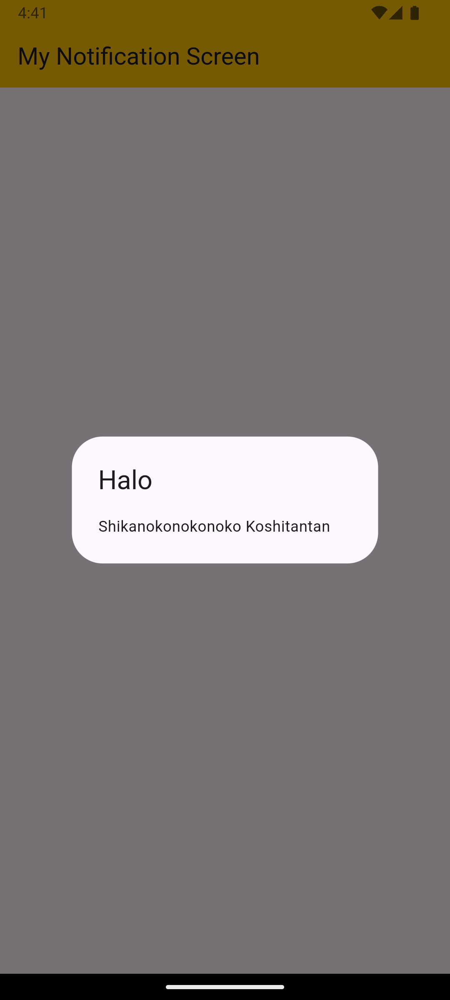


6. Selamat notifikasi anda berjalan sesuai harapan. Keep coding and don’t forget to take a rest...

# =======================

# UNGUIDED

Modifikasi Guided diatas bisa menampilkan Nama, Nim, Kelas, dan Prodi kalian ke dalam Notifikasi Flutter Cloud Messaging dan landing page notifikasinya.

## Source Code

Source code yang digunakan sama persis dengan yang ada pada folder GUIDED

## Output

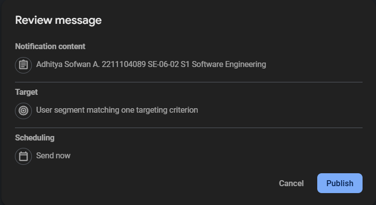
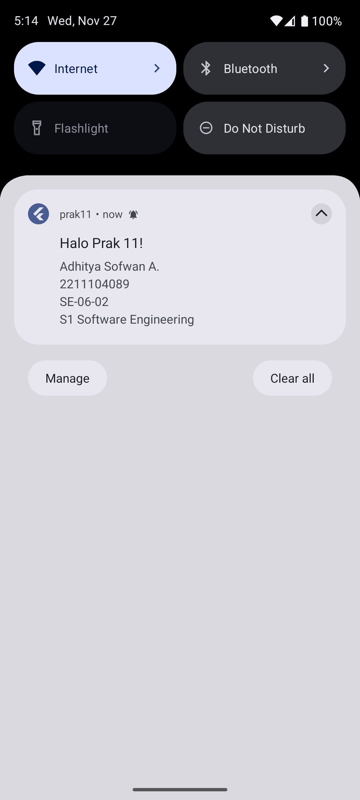
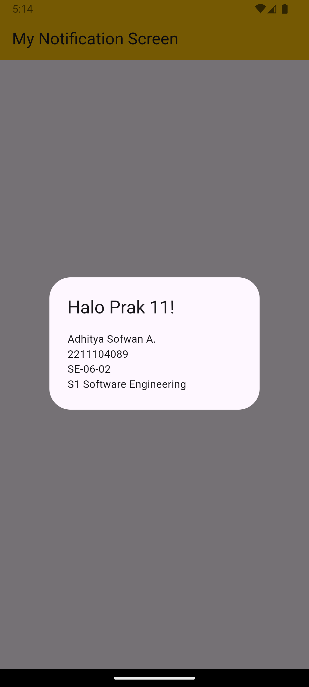

## Deskripsi Program

Aplikasi sederhana yang berfungsi untuk menerima notifikasi flutter cloud message. Message berisikan nama, nim, kelas, dan prodi.