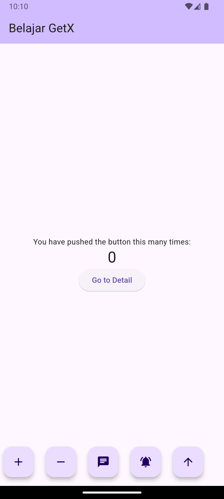
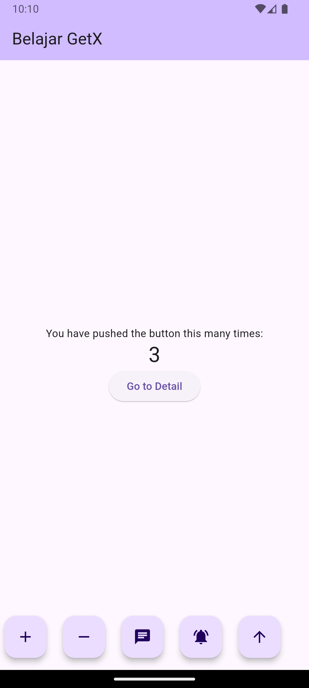
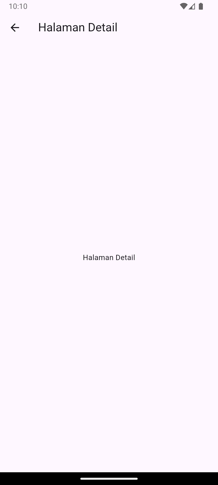
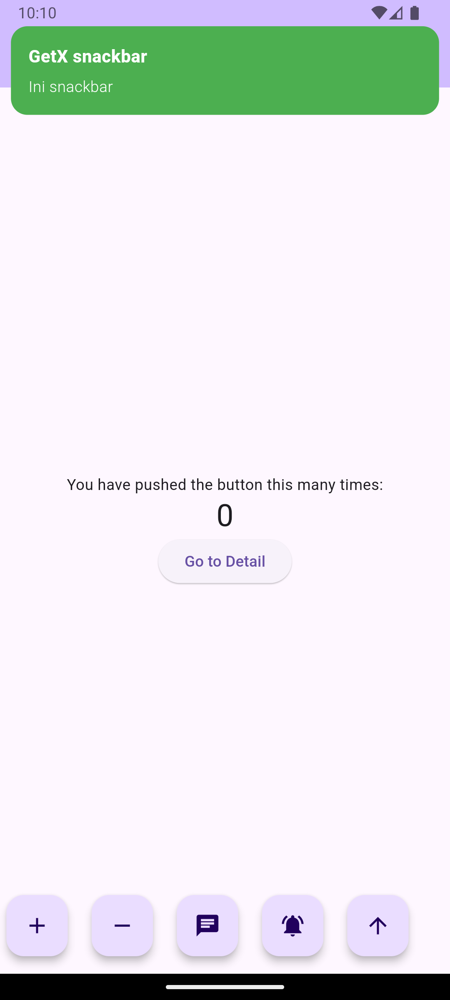
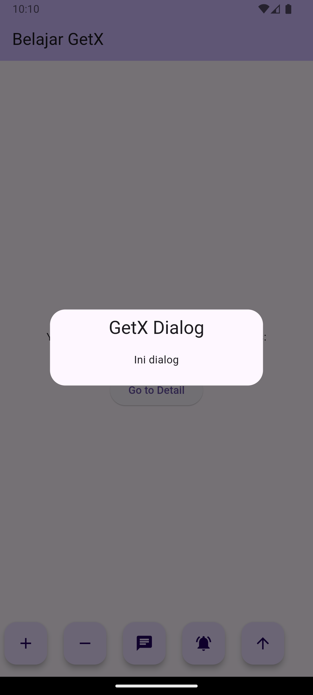
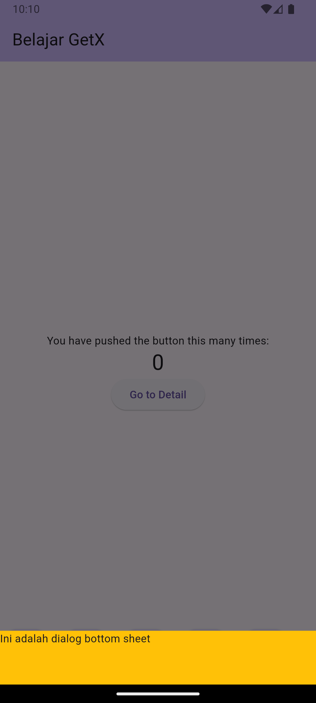
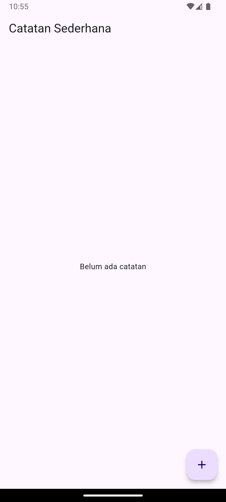
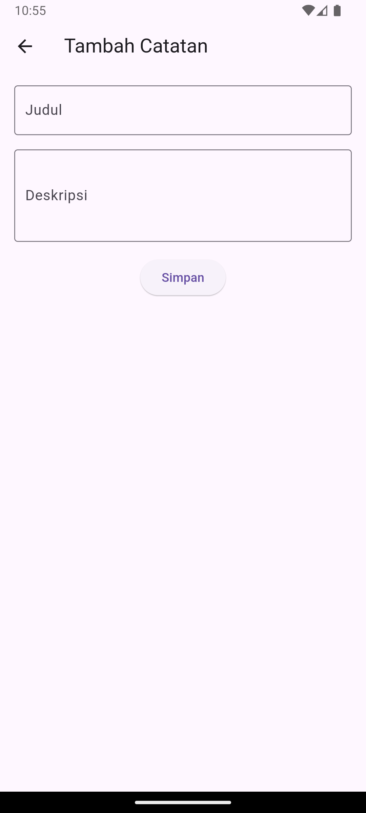
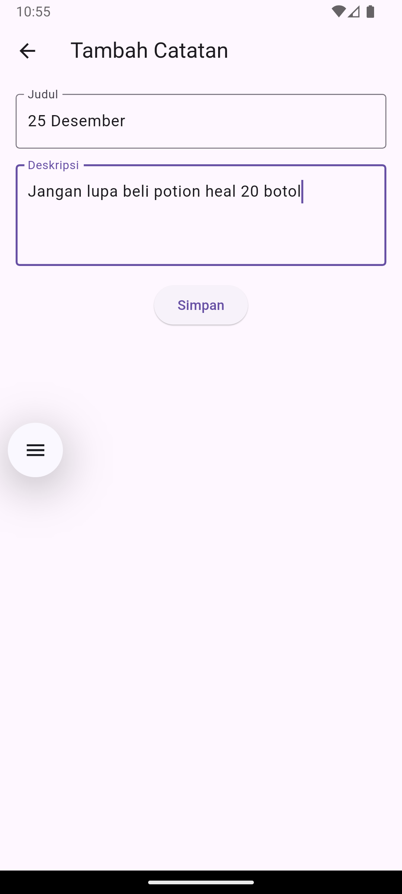
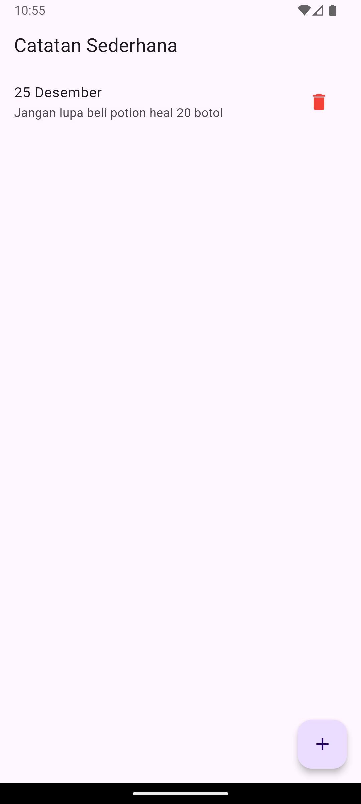

Praktikum Pertemuan ke 13 <br>
Adhitya Sofwan Al-Rasyid <br>
2211104089
# **NETWORKING**

# GUIDED

## NETWORKING/STATE MANAGEMENT
State management dalam Flutter adalah proses mengelola state atau status dari aplikasi, yaitu data atau informasi yang dapat berubah sepanjang siklus hidup aplikasi. State ini mencakup segala hal yang memengaruhi tampilan antarmuka pengguna (UI), seperti input pengguna, data dari API, dan status internal widget. Ketika aplikasi semakin kompleks dibuat, maka pasti akan ada saatnya dimana harus dibagikan state aplikasi ke berbagai halaman yang ada. 
Flutter adalah deklaratif, sehingga Flutter membangun user interface berdasarkan state saat ini. Dengan menggunakan state management, dapat dilakukan sentralisasi semua state dari berbagai macam UI Control untuk mengendalikan aliran data lintas aplikasi. 
State management penting karena aplikasi Flutter sering kali terdiri dari banyak widget yang saling terkait. Dengan mengelola state dengan baik, kita dapat memastikan :
- Sinkronisasi UI dan data, karena selalu mencerminkan data terkini.
- Organisasi kode yang baik untuk mempermudah pengembangan dan pemeliharaan.
- Pengurangan bug, karena state yang dikelola dengan benar mengurangi kemungkinan terjadinya bug.

## Jenis State dalam Flutter

### 1. Ephemeral State (State Lokal)
State ini hanya relevan untuk widget tertentu dan tidak dibagikan ke widget lain. Contohnya adalah state untuk TextField atau Checkbox. Dan kita dapat menggunakan StatefulWidget untuk mengelola ephemeral state. Pendekatannya state menaganement-nya ada dua, yakni StatefulWidget (untuk ephemeral state) dan InheritedWidget (untuk berbagai state antar widget). 

### 2. App State (State Global)
State ini digunakan di berbagai widget dalam aplikasi. Contohnya adalah informasi pengguna yang masuk, data keranjang belanja, atau tema aplikasi. App state biasanya membutuhkan pendekatan state management yang lebih kompleks. Package/library pendukung Flutter memiliki berbagai framework atau package untuk state management, seperti :

#### A. Provider
Provider adalah library state management yang didukung resmi oleh tim Flutter. Provider memanfaatkan kemampuan bawaan Flutter seperti InheritedWidget, tetapi dengan cara yang lebih sederhana dan efisien.
#### B. BloC/Cubit
Bloc (Business Logic Component) adalah pendekatan state management berbasis pola stream. Bloc memisahkan business logic dari UI, sehingga cocok untuk aplikasi yang besar dan kompleks.
#### C. Riverpod
Riverpod adalah framework state management modern yang dirancang sebagai pengganti atau alternatif untuk Provider. Riverpod lebih fleksibel dan mengatasi beberapa keterbatasan Provider.
#### D. GetX
GetX adalah framework Flutter serbaguna yang menyediakan solusi lengkap untuk state management, routing, dan dependency injection. GetX dirancang untuk meminimalkan boilerplate code, meningkatkan efisiensi, dan mempermudah pengembangan aplikasi Flutter, terutama yang memerlukan reaktivitas tinggi.


### Praktikum

tambahkan dependencies :
```
dependencies:
  flutter:
    sdk: flutter
  cupertino_icons: ^1.0.8
  get: ^4.6.6
```

main.dart
```
import 'package:flutter/material.dart';
import 'package:get/get.dart';
import 'package:prak13/view/detail_page.dart';
import 'package:prak13/view/my_home_page.dart';

void main() {
  runApp(const MyApp());
}

class MyApp extends StatelessWidget {
  const MyApp({super.key});

  @override
  Widget build(BuildContext context) {
    return GetMaterialApp(
      debugShowCheckedModeBanner: false,
      initialRoute: '/',
      getPages: [
        GetPage(
          name: '/', 
          page: () => MyHomePage(title: 'Belajar GetX', Text: '',)
        ),
        GetPage(
          name: '/detail', 
          page: () => DetailPage()
        ),
      ]
    );
  }
}
```

detail_page.dart
```
import 'package:flutter/material.dart';

class DetailPage extends StatelessWidget {
  const DetailPage({super.key});

  @override
  Widget build(BuildContext context) {
    return Scaffold(
      appBar: AppBar(
        title: const Text('Halaman Detail'),
      ),
      body: const Center(
        child: Text('Halaman Detail'),
      )
    );
  }
}
```

my_home_page.dart
```
import 'package:flutter/material.dart';
import 'package:get/get.dart';
import 'package:prak13/view/detail_page.dart';
import 'package:prak13/viewmodel/counter_controller.dart';

class MyHomePage extends StatelessWidget {
  MyHomePage({super.key, required this.title, required String Text});

  final String title;
  final CounterController controller = Get.put(CounterController());

  @override
  Widget build(BuildContext context) {
    return Scaffold(
      appBar: AppBar(
        backgroundColor: Theme.of(context).colorScheme.inversePrimary,
        title: Text(title),
      ),
      body: Center(
        child: Obx(
          () => Column(
            mainAxisAlignment: MainAxisAlignment.center,
            children: <Widget>[
              const Text(
                'You have pushed the button this many times:',
              ),
              Text(
                controller.counter.toString(),
                style: Theme.of(context).textTheme.headlineMedium,
              ),
              ElevatedButton(onPressed: () {
                // Get.toNamed('/detail');
                Get.to(DetailPage());
              }, 
              child: Text('Go to Detail'))
            ],
          ),
        ),
      ),
      floatingActionButton: Row(
        mainAxisAlignment: MainAxisAlignment.spaceEvenly,
        children: [
          FloatingActionButton(
            onPressed: controller.incrementCounter,
            tooltip: 'Increment',
            child: const Icon(Icons.add),
          ),
          FloatingActionButton(
            onPressed: controller.decrementCounter,
            tooltip: 'decrement',
            child: const Icon(Icons.remove),
          ),
          FloatingActionButton(
            onPressed: controller.getsnackbar,
            // onPressed: () {
            //   ScaffoldMessenger.of(context).showSnackBar(
            //     SnackBar(content: Text('ini adalah snackbar material')));
            // },
            tooltip: 'snackbar',
            child: const Icon(Icons.chat),
          ),
          FloatingActionButton(
            onPressed: controller.getdialog,
            tooltip: 'getdialog',
            child: const Icon(Icons.notifications_active),
          ),
          FloatingActionButton(
            onPressed: controller.getbottomsheet,
            tooltip: 'getbottomsheet',
            child: const Icon(Icons.arrow_upward),
          ),
        ],
      ),
    );
  }
}
```

counter_controller.dart
```
import 'package:flutter/material.dart';
import 'package:get/get.dart';

class CounterController extends GetxController {
  var counter = 0.obs;

  void incrementCounter(){
    counter++;
  }

  void decrementCounter(){
    counter--;
  }

  void getsnackbar(){
    Get.snackbar(
      'GetX snackbar',
      'Ini snackbar', 
      colorText: Colors.white,
      backgroundColor: Colors.green
    );
  }

  void getdialog(){
    Get.defaultDialog(
      title: 'GetX Dialog',
      middleText: 'Ini dialog',
    );
  }

  void getbottomsheet(){
    Get.bottomSheet(Container(
      height: 70,
      width: double.infinity,
      color: Colors.amber,
      child: Text('Ini adalah dialog bottom sheet'),
    ));
  }
}
```










# =======================

# UNGUIDED

Buatlah Aplikasi Catatan Sederhana menggunakan GetX, dengan ketentuan sebagai berikut :
1. Halaman utama atau Homepage untuk menampilkan daftar catatan yang telah ditambahkan. Setiap catatan terdiri dari judul dan deskripsi singkat, serta terdapat tombol untuk menghapus catatan dari daftar.
2. Halaman kedua untuk menambah catatan baru, berisi : form untuk memasukkan judul dan deskripsi catatan, serta tombol untuk menyimpan catatan ke daftar (Homepage).
3. Menggunakan getx controller.
4. Menggunakan getx routing untuk navigasi halaman.

## Source Code

tambahkan dependency :
```
dependencies:
  flutter:
    sdk: flutter
  cupertino_icons: ^1.0.8
  get: ^4.6.6
```

note_controller.dart
```
import 'package:get/get.dart';

class Note {
  final String title;
  final String description;

  Note({
    required this.title,
    required this.description,
  });
}

class NoteController extends GetxController {
  // List untuk menyimpan catatan
  var notes = <Note>[].obs;

  // Tambah catatan
  void addNote(String title, String description) {
    notes.add(Note(title: title, description: description));
  }

  // Hapus catatan berdasarkan index
  void removeNote(int index) {
    notes.removeAt(index);
  }
}
```

home_page.dart
```
import 'package:flutter/material.dart';
import 'package:get/get.dart';
import 'package:prak13/controller/note_controller.dart';

class HomePage extends StatelessWidget {
  final NoteController noteController = Get.put(NoteController());

  @override
  Widget build(BuildContext context) {
    return Scaffold(
      appBar: AppBar(
        title: const Text('Catatan Sederhana'),
      ),
      body: Obx(() {
        if (noteController.notes.isEmpty) {
          return const Center(
            child: Text('Belum ada catatan'),
          );
        } else {
          return ListView.builder(
            itemCount: noteController.notes.length,
            itemBuilder: (context, index) {
              final note = noteController.notes[index];
              return ListTile(
                title: Text(note.title),
                subtitle: Text(note.description),
                trailing: IconButton(
                  icon: const Icon(Icons.delete, color: Colors.red),
                  onPressed: () {
                    noteController.removeNote(index);
                  },
                ),
              );
            },
          );
        }
      }),
      floatingActionButton: FloatingActionButton(
        onPressed: () {
          Get.toNamed('/add');
        },
        tooltip: 'Tambah Catatan',
        child: const Icon(Icons.add),
      ),
    );
  }
}
```

add_note_page.dart
```
import 'package:flutter/material.dart';
import 'package:get/get.dart';
import 'package:prak13/controller/note_controller.dart';

class AddNotePage extends StatelessWidget {
  final NoteController noteController = Get.find<NoteController>();

  final TextEditingController titleController = TextEditingController();
  final TextEditingController descriptionController = TextEditingController();

  @override
  Widget build(BuildContext context) {
    return Scaffold(
      appBar: AppBar(
        title: const Text('Tambah Catatan'),
      ),
      body: Padding(
        padding: const EdgeInsets.all(16.0),
        child: Column(
          children: [
            TextField(
              controller: titleController,
              decoration: const InputDecoration(
                labelText: 'Judul',
                border: OutlineInputBorder(),
              ),
            ),
            const SizedBox(height: 16),
            TextField(
              controller: descriptionController,
              decoration: const InputDecoration(
                labelText: 'Deskripsi',
                border: OutlineInputBorder(),
              ),
              maxLines: 3,
            ),
            const SizedBox(height: 16),
            ElevatedButton(
              onPressed: () {
                final title = titleController.text.trim();
                final description = descriptionController.text.trim();

                if (title.isNotEmpty && description.isNotEmpty) {
                  noteController.addNote(title, description);
                  Get.back(); // Kembali ke halaman sebelumnya
                } else {
                  Get.snackbar(
                    'Error',
                    'Judul dan Deskripsi tidak boleh kosong!',
                    snackPosition: SnackPosition.BOTTOM,
                  );
                }
              },
              child: const Text('Simpan'),
            ),
          ],
        ),
      ),
    );
  }
}
```

main.dart
```
import 'package:flutter/material.dart';
import 'package:get/get.dart';
import 'package:prak13/view/add_note_page.dart';
import 'package:prak13/view/home_page.dart';

void main() {
  runApp(MyApp());
}

class MyApp extends StatelessWidget {
  @override
  Widget build(BuildContext context) {
    return GetMaterialApp(
      debugShowCheckedModeBanner: false,
      title: 'Aplikasi Catatan',
      initialRoute: '/', // Rute awal
      getPages: [
        GetPage(
          name: '/', 
          page: () => HomePage()
        ), // Halaman Utama
        GetPage(
          name: '/add', 
          page: () => AddNotePage()
        ), // Halaman Tambah Catatan
      ]
    );
  }
}
```

## Output






## Deskripsi Program

Aplikasi ini berfungsi untuk mencatat informasi berupa judul dan deskripsi. Pengguna dapat menambahkan catatan baru melalui halaman `add` yang menyediakan form input untuk memasukkan judul dan deskripsi, kemudian menyimpan catatan tersebut ke dalam daftar yang ditampilkan pada halaman utama. Aplikasi ini menggunakan GetX sebagai state management, serta menggunakan GetX routing untuk navigasi antar halaman.