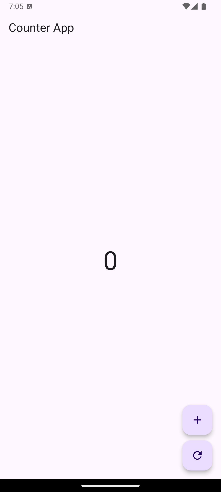
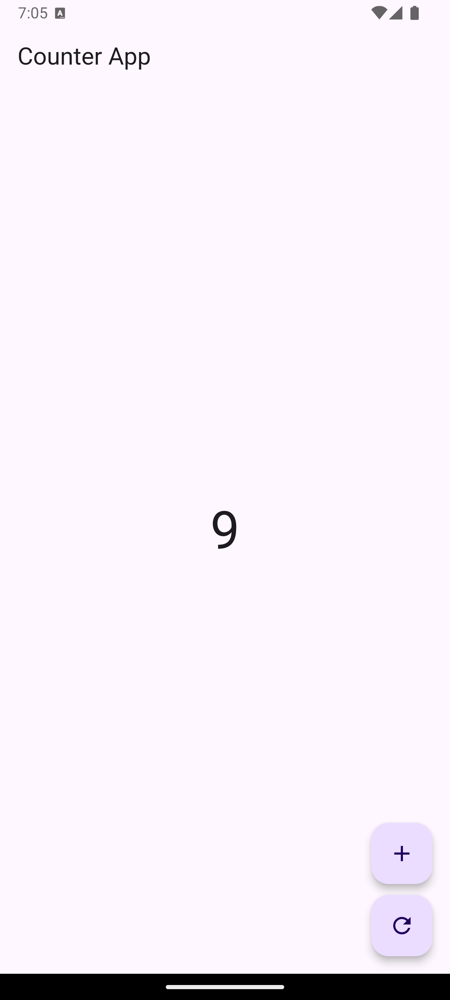

# TUGAS PENDAHULUAN

1. Apa yang dimaksud dengan state management pada Flutter?
2. Sebut dan jelaskan komponen-komponen yang ada di dalam GetX.
3. Lengkapilah code di bawah ini, dan tampilkan hasil outputnya serta jelaskan.
```
import 'package:flutter/material.dart';
import 'package:get/get.dart';

/// Controller untuk mengelola state counter
class CounterController extends GetxController {
    // TODO: Tambahkan variabel untuk menyimpan nilai counter

    // TODO: Buat fungsi untuk menambah nilai counter

    // TODO: Buat fungsi untuk mereset nilai counter
}

class HomePage extends StatelessWidget {
    final CounterController controller = 
    Get.put(CounterController());
    
    @override
    Widget build(BuildContext context) {
        return Scaffold(
            appBar: AppBar(title: Text("Counter App")),
            body: Center(
                child: Obx(() {
                // TODO: Lengkapi logika untuk menampilkan nilai counter
                    return Text(
                    "0", // Ganti ini dengan nilai counter
                    style: TextStyle(fontSize: 48),
                    );
                }),
            ),
            floatingActionButton: Column(
                mainAxisAlignment: MainAxisAlignment.end,children: [
                    FloatingActionButton(
                        onPressed: () {
                            // TODO: Tambahkan logika untuk menambah nilai counter
                        },
                        child: Icon(Icons.add),
                    ),
                    SizedBox(height: 10),
                    FloatingActionButton(
                        onPressed: () {
                            // TODO: Tambahkan logika untuk mereset nilai counter
                        },
                        child: Icon(Icons.refresh),
                    ),
                ],
            ),
        );
    }
}

void main() {
    runApp(MaterialApp(
        debugShowCheckedModeBanner: false,
        home: HomePage(),
    ));
}
```

# JAWABAN

1. State management adalah cara mengelola state (data atau keadaan) yang dapat berubah dalam aplikasi sehingga UI selalu mencerminkan perubahan state tersebut. Flutter menyediakan beberapa cara untuk state management, mulai dari `setState` untuk state lokal, hingga `Provider`, `Riverpod`, atau `Bloc` untuk state yang lebih kompleks dan perlu dibagikan antar widget. Pemilihan metode tergantung pada skala dan kebutuhan aplikasi dengan tujuan menjaga performa, efisiensi, dan kemudahan maintenance.

2. Komponen-komponen dalam GetX:
    #### A. State Management
   - GetBuilder: 
     - Digunakan untuk *state management* reaktif sederhana.
     - Widget ini akan diperbarui hanya ketika metode `update()` dipanggil pada *controller* terkait.
     - Sangat efisien karena hanya membangun ulang widget yang terkait.

   - Obx:
     - Digunakan untuk *state management* yang lebih dinamis dan reaktif.
     - Mengandalkan *observable* (variabel yang diubah menjadi reaktif menggunakan `Rx` atau `Rxn`).
     - Secara otomatis memperbarui UI setiap kali nilai yang dipantau berubah.

   - Rx (Reactive Variables):
     - Variabel yang dibuat reaktif dengan menambahkan `.obs` di akhir, misalnya `var counter = 0.obs`.
     - Perubahan pada variabel ini secara otomatis memicu pembaruan pada widget yang menggunakan `Obx`.

    #### B. Route Management
   - Navigasi tanpa Context:
     - GetX memungkinkan navigasi antar halaman tanpa memerlukan `BuildContext`.
     - Contoh: `Get.to(NextPage())`, `Get.back()`, atau `Get.offAll(HomePage())`.

   - Dynamic Routes:
     - Mendukung pengelolaan rute dengan parameter dinamis menggunakan `Get.parameters`.
     - Contoh: `Get.toNamed('/user?id=123')`.

   - Middleware:
     - Digunakan untuk melakukan logika tertentu sebelum masuk ke rute, seperti autentikasi atau izin akses.

    #### C. Dependency Injection (DI)
   - Get.put:
     - Digunakan untuk menginisialisasi dan menyediakan *dependency* di dalam aplikasi.
     - Contoh: `Get.put(MyController())`.

   - Get.lazyPut:
     - Hanya membuat *dependency* saat dibutuhkan.
     - Contoh: `Get.lazyPut(() => MyController())`.

   - Get.find:
     - Digunakan untuk mengambil *dependency* yang telah didaftarkan sebelumnya.
     - Contoh: `final controller = Get.find<MyController>()`.

   - Get.delete:
     - Digunakan untuk menghapus *dependency* dari memori saat tidak lagi dibutuhkan.

    #### D. Snackbar, Dialog, dan BottomSheet
   - Snackbar:
     - Menampilkan pemberitahuan kecil di layar menggunakan `Get.snackbar(title, message)`.

   - Dialog:
     - Membuka dialog tanpa memerlukan *context* menggunakan `Get.defaultDialog()`.

   - BottomSheet:
     - Menampilkan *bottom sheet* dengan `Get.bottomSheet(widget)`.

    #### E. Internationalization (i18n)
   - GetX memudahkan penerapan bahasa lokal tanpa pustaka tambahan.
   - Contoh:
     - Buat file terjemahan.
     - Gunakan `GetMaterialApp(translations: MyTranslations())` untuk memuatnya.
     - Panggil `Get.updateLocale(locale)` untuk mengubah bahasa secara dinamis.

    #### F. GetConnect
   - Komponen bawaan untuk komunikasi HTTP, WebSocket, atau REST API.
   - Mendukung pengelolaan header, otentikasi, dan lainnya.
   - Contoh: `GetConnect().get('https://example.com')`.

    #### G. Worker:
   - Mengawasi perubahan pada variabel reaktif dan mengeksekusi tindakan tertentu.
   - Contoh:
     ```dart
     ever(counter, (_) => print("Counter changed"));
     ```

3. Lengkapi Kode

#### kode :
```
import 'package:flutter/material.dart';
import 'package:get/get.dart';

/// Controller untuk mengelola state counter
class CounterController extends GetxController {
  // Variabel untuk menyimpan nilai counter
  var counter = 0.obs;

  // Fungsi untuk menambah nilai counter
  void increment() {
    counter++;
  }

  // Fungsi untuk mereset nilai counter
  void reset() {
    counter.value = 0;
  }
}

class HomePage extends StatelessWidget {
  final CounterController controller = Get.put(CounterController());

  @override
  Widget build(BuildContext context) {
    return Scaffold(
      appBar: AppBar(title: Text("Counter App")),
      body: Center(
        child: Obx(() {
          // Menampilkan nilai counter
          return Text(
            "${controller.counter}", // Menampilkan nilai counter
            style: TextStyle(fontSize: 48),
          );
        }),
      ),
      floatingActionButton: Column(
        mainAxisAlignment: MainAxisAlignment.end,
        children: [
          FloatingActionButton(
            onPressed: () {
              // Menambah nilai counter
              controller.increment();
            },
            child: Icon(Icons.add),
          ),
          SizedBox(height: 10),
          FloatingActionButton(
            onPressed: () {
              // Mereset nilai counter
              controller.reset();
            },
            child: Icon(Icons.refresh),
          ),
        ],
      ),
    );
  }
}

void main() {
  runApp(MaterialApp(
    debugShowCheckedModeBanner: false,
    home: HomePage(),
  ));
}

```

#### output :




Kode di atas menggunakan GetX untuk mengelola state counter. Kode ini memiliki CounterController yang menyimpan nilai counter menggunakan variabel observasi counter dengan .obs, serta menyediakan dua metode: increment() untuk menambah nilai counter dan reset() untuk mengatur nilai counter ke 0. Pada halaman utama (HomePage), ada dua tombol mengambang (FloatingActionButton): satu untuk menambah counter dan satu lagi untuk meresetnya. UI menggunakan widget Obx untuk mendengarkan perubahan pada nilai counter dan memperbarui tampilan secara otomatis setiap kali nilai counter berubah.