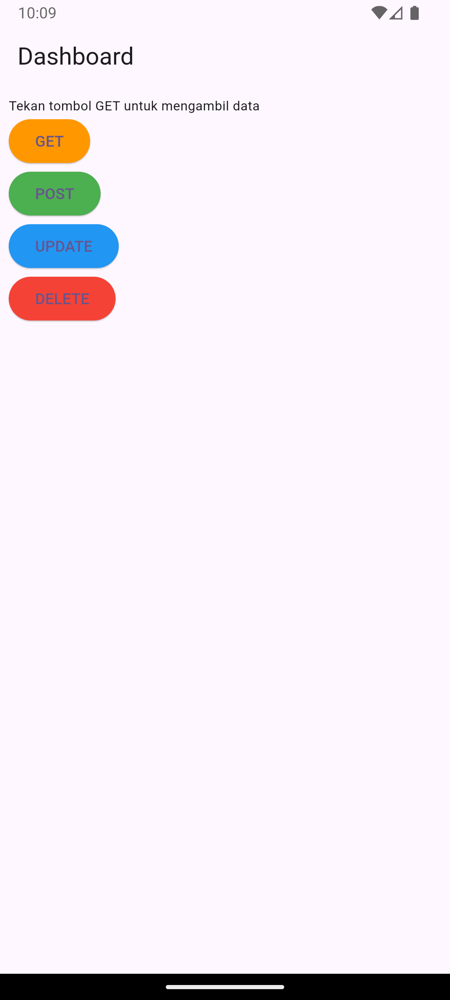
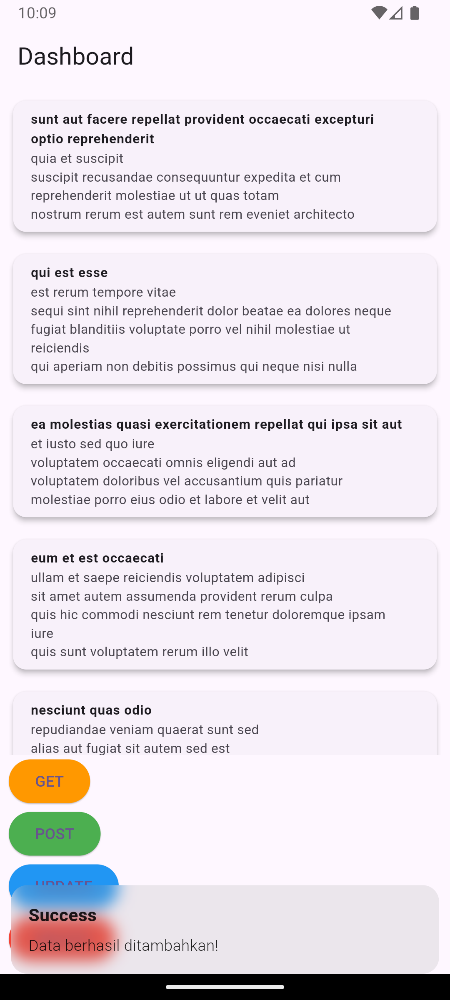

Praktikum Pertemuan ke 14 <br>
Adhitya Sofwan Al-Rasyid <br>
2211104089
# **DATA STORAGE (API)**

# GUIDED

## Data Storage dengan Rest API

### Apa itu Rest API
REST API (Representational State Transfer Application Programming Interface) adalah antarmuka yang memungkinkan aplikasi klien untuk berinteraksi dengan database melalui protokol HTTP. REST API menyediakan cara untuk membaca, menambahkan, memperbarui, dan menghapus data dari database tanpa harus mengakses database langsung.Mendapatkan token unik dari setiap perangkat pengguna. 
Kegunaan REST API :
1. Interoperabilitas: REST API memungkinkan aplikasi berbasis web dan mobile untuk mengakses data yang sama.
2. Efisiensi: Data yang dikirimkan biasanya ringan (format JSON atau XML), membuatnya cepat untuk dikirim dan diterima.
3. Keamanan: API bisa membatasi akses menggunakan token autentikasi.

### Apa itu HTTP
HTTP (Hypertext Transfer Protocol) adalah protokol komunikasi utama yang digunakan untuk mengirimkan data antara klien (misalnya browser atau aplikasi) dan server. 
Metode HTTP Utama :
1. GET: Mengambil data dari server.
2. POST: Mengirim data baru ke server.
3. PUT/PATCH: Memperbarui data yang ada di server.
4. DELETE: Menghapus data dari server.

Komponen HTTP Request
1. URL: Alamat yang menunjukkan resource tertentu.
2. Method: Operasi yang akan dilakukan (GET, POST, dll.).
3. Headers: Informasi tambahan seperti format data atau token autentikasi.
4. Body: Data yang dikirimkan (digunakan dalam POST/PUT).

Komponen HTTP Response
1. Status Code: Menunjukkan hasil operasi (misalnya, 200 untuk berhasil, 404 untuk resource tidak ditemukan).
2. Headers: Informasi tambahan dari server.
3. Body: Data yang dikembalikan server (biasanya dalam format JSON).

### Praktikum

tambah dependency :
```
dependencies:
  flutter:
    sdk: flutter
  cupertino_icons: ^1.0.8
  http: ^1.2.2
```

api_service.dart
```
import 'dart:convert';
import 'package:http/http.dart' as http;

class ApiService {
  final String baseUrl = "https://jsonplaceholder.typicode.com";
  List<dynamic> posts = []; // Menyimpan data post yang diterima
  // Fungsi untuk GET data
  Future<void> fetchPosts() async {
    final response = await http.get(Uri.parse('$baseUrl/posts'));
    if (response.statusCode == 200) {
      posts = json.decode(response.body);
    } else {
      throw Exception('Failed to load posts');
    }
  }

  // Fungsi untuk POST data
  Future<void> createPost() async {
    final response = await http.post(
      Uri.parse('$baseUrl/posts'),
      headers: {'Content-Type': 'application/json'},
      body: json.encode({
        'title': 'Flutter Post',
        'body': 'Ini contoh POST.',
        'userId': 1,
      }),
    );
    if (response.statusCode == 201) {
      posts.add({
        'title': 'Flutter Post',
        'body': 'Ini contoh POST.',
        'id': posts.length + 1,
      });
    } else {
      throw Exception('Failed to create post');
    }
  }

  // Fungsi untuk UPDATE data
  Future<void> updatePost() async {
    final response = await http.put(
      Uri.parse('$baseUrl/posts/1'),
      body: json.encode({
        'title': 'Updated Title',
        'body': 'Updated Body',
        'userId': 1,
      }),
    );
    if (response.statusCode == 200) {
      final updatedPost = posts.firstWhere((post) => post['id'] == 1);
      updatedPost['title'] = 'Updated Title';
      updatedPost['body'] = 'Updated Body';
    } else {
      throw Exception('Failed to update post');
    }
  }

  // Fungsi untuk DELETE data
  Future<void> deletePost() async {
    final response = await http.delete(
      Uri.parse('$baseUrl/posts/1'),
    );
    if (response.statusCode == 200) {
      posts.removeWhere((post) => post['id'] == 1);
    } else {
      throw Exception('Failed to delete post');
    }
  }
}
```

homepage_screen.dart
```
import 'package:flutter/material.dart';
import 'package:prak14/services/api_service.dart';

class HomePageScreen extends StatefulWidget {
  const HomePageScreen({super.key});

  @override
  State<HomePageScreen> createState() => _HomePageScreenState();
}

class _HomePageScreenState extends State<HomePageScreen> {
  List<dynamic> _posts = []; // Menyimpan list posts
  bool _isLoading = false; // Untuk indikator loading
  final ApiService _apiService = ApiService(); // Instance ApiService
  // Fungsi untuk menampilkan SnackBar
  void _showSnackBar(String message) {
    ScaffoldMessenger.of(context)
        .showSnackBar(SnackBar(content: Text(message)));
  }

  // Fungsi untuk memanggil API dan menangani operasi
  Future<void> _handleApiOperation(
      Future<void> operation, String successMessage) async {
    setState(() {
      _isLoading = true;
    });

    try {
      await operation; // Menjalankan operasi API
      setState(() {
        _posts = _apiService.posts;
      });
      _showSnackBar(successMessage);
    } catch (e) {
      _showSnackBar('Error: $e');
    } finally {
      setState(() {
        _isLoading = false;
      });
    }
  }

  @override
  Widget build(BuildContext context) {
    return Scaffold(
      appBar: AppBar(
        title: const Text("Dashboard"),
      ),
      body: Padding(
        padding: const EdgeInsets.all(8.0),
        child: Column(
          crossAxisAlignment: CrossAxisAlignment.start,
          children: [
            _isLoading
                ? const Center(child: CircularProgressIndicator())
                : _posts.isEmpty
                    ? const Text(
                        "Tekan tombol GET untuk mengambil data",
                        style: TextStyle(fontSize: 12),
                      )
                    : Expanded(
                        child: ListView.builder(
                          itemCount: _posts.length,
                          itemBuilder: (context, index) {
                            return Padding(
                              padding: const EdgeInsets.only(bottom: 12.0),
                              child: Card(
                                elevation: 4,
                                child: ListTile(
                                  title: Text(
                                    _posts[index]['title'],
                                    style: const TextStyle(
                                        fontWeight: FontWeight.bold,
                                        fontSize: 12),
                                  ),
                                  subtitle: Text(
                                    _posts[index]['body'],
                                    style: const TextStyle(fontSize: 12),
                                  ),
                                ),
                              ),
                            );
                          },
                        ),
                      ),
            ElevatedButton(
              onPressed: () => _handleApiOperation(
                  _apiService.fetchPosts(), 'Data berhasil diambil!'),
              style: ElevatedButton.styleFrom(backgroundColor: Colors.orange),
              child: const Text('GET'),
            ),
            ElevatedButton(
              onPressed: () => _handleApiOperation(
                  _apiService.createPost(), 'Data berhasil ditambahkan!'),
              style: ElevatedButton.styleFrom(backgroundColor: Colors.green),
              child: const Text('POST'),
            ),
            ElevatedButton(
              onPressed: () => _handleApiOperation(
                  _apiService.updatePost(), 'Data berhasil diperbarui!'),
              style: ElevatedButton.styleFrom(backgroundColor: Colors.blue),
              child: const Text('UPDATE'),
            ),
            ElevatedButton(
              onPressed: () => _handleApiOperation(
                  _apiService.deletePost(), 'Data berhasil dihapus!'),
              style: ElevatedButton.styleFrom(backgroundColor: Colors.red),
              child: const Text('DELETE'),
            ),
          ],
        ),
      ),
    );
  }
}
```

main.dart
```
import 'package:flutter/material.dart';
import 'package:prak14/screens/homepage_screen.dart';

void main() {
  runApp(const MyApp());
}

class MyApp extends StatelessWidget {
  const MyApp({super.key});

  @override
  Widget build(BuildContext context) {
    return MaterialApp(
      debugShowCheckedModeBanner: false,
      title: 'Flutter Demo',
      theme: ThemeData(
        
        colorScheme: ColorScheme.fromSeed(seedColor: Colors.deepPurple),
        useMaterial3: true,
      ),
      home: const HomePageScreen(),
    );
  }
}
```
 
 
 
 
 


# =======================

# UNGUIDED

Modifikasi tampilan Guided dari praktikum di atas:

1. Gunakan State Management dengan GetX:
    - Atur data menggunakan state management GetX agar lebih mudah dikelola.
    - Implementasi GetX meliputi pembuatan controller untuk mengelola data dan penggunaan widget Obx untuk menampilkan data secara otomatis setiap kali ada perubahan.
2. Tambahkan Snackbar untuk Memberikan Respon Berhasil:
    - Tampilkan snackbar setelah setiap operasi berhasil, seperti menambah atau memperbarui data.
    - Gunakan Get.snackbar agar pesan sukses muncul di layar dan mudah dipahami oleh pengguna


## Source Code

tambah dependency :
```
dependencies:
  flutter:
    sdk: flutter
  cupertino_icons: ^1.0.8
  http: ^1.2.2
  get: ^4.6.6
```

api_service.dart
```
import 'dart:convert';
import 'package:http/http.dart' as http;
import 'package:get/get.dart';

class ApiService extends GetxController {
  final String baseUrl = "https://jsonplaceholder.typicode.com";
  var posts = <dynamic>[].obs; // Data posts sebagai Observable
  var isLoading = false.obs; // State loading

  // Fungsi untuk GET data
  Future<void> fetchPosts() async {
    isLoading.value = true;
    try {
      final response = await http.get(Uri.parse('$baseUrl/posts'));
      if (response.statusCode == 200) {
        posts.value = json.decode(response.body);
        Get.snackbar('Success', 'Data berhasil diambil!', snackPosition: SnackPosition.BOTTOM);
      } else {
        throw Exception('Failed to load posts');
      }
    } catch (e) {
      Get.snackbar('Error', e.toString(), snackPosition: SnackPosition.BOTTOM);
    } finally {
      isLoading.value = false;
    }
  }

  // Fungsi untuk POST data
  Future<void> createPost() async {
    isLoading.value = true;
    try {
      final response = await http.post(
        Uri.parse('$baseUrl/posts'),
        headers: {'Content-Type': 'application/json'},
        body: json.encode({
          'title': 'Flutter Post',
          'body': 'Ini contoh POST.',
          'userId': 1,
        }),
      );
      if (response.statusCode == 201) {
        posts.add({
          'title': 'Flutter Post',
          'body': 'Ini contoh POST.',
          'id': posts.length + 1,
        });
        Get.snackbar('Success', 'Data berhasil ditambahkan!', snackPosition: SnackPosition.BOTTOM);
      } else {
        throw Exception('Failed to create post');
      }
    } catch (e) {
      Get.snackbar('Error', e.toString(), snackPosition: SnackPosition.BOTTOM);
    } finally {
      isLoading.value = false;
    }
  }

  // Fungsi untuk UPDATE data
  Future<void> updatePost() async {
    isLoading.value = true;
    try {
      final response = await http.put(
        Uri.parse('$baseUrl/posts/1'),
        body: json.encode({
          'title': 'Updated Title',
          'body': 'Updated Body',
          'userId': 1,
        }),
      );
      if (response.statusCode == 200) {
        final updatedPost = posts.firstWhere((post) => post['id'] == 1);
        updatedPost['title'] = 'Updated Title';
        updatedPost['body'] = 'Updated Body';
        posts.refresh();
        Get.snackbar('Success', 'Data berhasil diperbarui!', snackPosition: SnackPosition.BOTTOM);
      } else {
        throw Exception('Failed to update post');
      }
    } catch (e) {
      Get.snackbar('Error', e.toString(), snackPosition: SnackPosition.BOTTOM);
    } finally {
      isLoading.value = false;
    }
  }

  // Fungsi untuk DELETE data
  Future<void> deletePost() async {
    isLoading.value = true;
    try {
      final response = await http.delete(
        Uri.parse('$baseUrl/posts/1'),
      );
      if (response.statusCode == 200) {
        posts.removeWhere((post) => post['id'] == 1);
        Get.snackbar('Success', 'Data berhasil dihapus!', snackPosition: SnackPosition.BOTTOM);
      } else {
        throw Exception('Failed to delete post');
      }
    } catch (e) {
      Get.snackbar('Error', e.toString(), snackPosition: SnackPosition.BOTTOM);
    } finally {
      isLoading.value = false;
    }
  }
}
```

homepage_screen.dart
```
import 'package:flutter/material.dart';
import 'package:get/get.dart';
import 'package:prak14/services/api_service.dart';

class HomePageScreen extends StatelessWidget {
  final ApiService _apiService = Get.put(ApiService()); // Inject controller

  @override
  Widget build(BuildContext context) {
    return Scaffold(
      appBar: AppBar(
        title: const Text("Dashboard"),
      ),
      body: Padding(
        padding: const EdgeInsets.all(8.0),
        child: Column(
          crossAxisAlignment: CrossAxisAlignment.start,
          children: [
            Obx(() => _apiService.isLoading.value
                ? const Center(child: CircularProgressIndicator())
                : _apiService.posts.isEmpty
                    ? const Text(
                        "Tekan tombol GET untuk mengambil data",
                        style: TextStyle(fontSize: 12),
                      )
                    : Expanded(
                        child: ListView.builder(
                          itemCount: _apiService.posts.length,
                          itemBuilder: (context, index) {
                            return Padding(
                              padding: const EdgeInsets.only(bottom: 12.0),
                              child: Card(
                                elevation: 4,
                                child: ListTile(
                                  title: Text(
                                    _apiService.posts[index]['title'],
                                    style: const TextStyle(
                                        fontWeight: FontWeight.bold,
                                        fontSize: 12),
                                  ),
                                  subtitle: Text(
                                    _apiService.posts[index]['body'],
                                    style: const TextStyle(fontSize: 12),
                                  ),
                                ),
                              ),
                            );
                          },
                        ),
                      )),
            ElevatedButton(
              onPressed: () => _apiService.fetchPosts(),
              style: ElevatedButton.styleFrom(backgroundColor: Colors.orange),
              child: const Text('GET'),
            ),
            ElevatedButton(
              onPressed: () => _apiService.createPost(),
              style: ElevatedButton.styleFrom(backgroundColor: Colors.green),
              child: const Text('POST'),
            ),
            ElevatedButton(
              onPressed: () => _apiService.updatePost(),
              style: ElevatedButton.styleFrom(backgroundColor: Colors.blue),
              child: const Text('UPDATE'),
            ),
            ElevatedButton(
              onPressed: () => _apiService.deletePost(),
              style: ElevatedButton.styleFrom(backgroundColor: Colors.red),
              child: const Text('DELETE'),
            ),
          ],
        ),
      ),
    );
  }
}
```

main.dart
```
import 'package:flutter/material.dart';
import 'package:prak14/screens/homepage_screen.dart';
import 'package:get/get.dart';

void main() {
  runApp(const MyApp());
}

class MyApp extends StatelessWidget {
  const MyApp({super.key});

  @override
  Widget build(BuildContext context) {
    return GetMaterialApp(
      debugShowCheckedModeBanner: false,
      title: 'Flutter Demo',
      theme: ThemeData(
        colorScheme: ColorScheme.fromSeed(seedColor: Colors.deepPurple),
        useMaterial3: true,
      ),
      home: HomePageScreen(),
    );
  }
}
```

## Output






## Deskripsi Program

Program diatas adalah modifikasi dari GUIDE, modifikasi yang dilakukan ialah penggunaan GetX untuk mengelola state dan melakukan operasi CRUD pada data dari JSONPlaceholder API. Selain itu, aplikasi memberikan notifikasi melalui Get.snackbar untuk memberi tahu pengguna tentang status keberhasilan atau kegagalan setiap operasi.